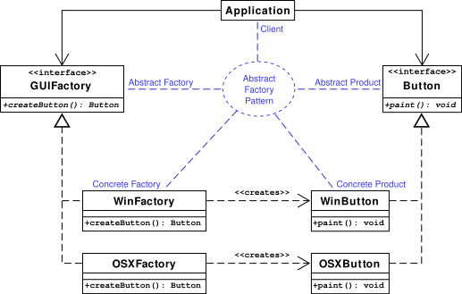

생성 - Abstract Factory
=========

> 날짜 : 2020.02.03

## 추상 팩토리(Abstract Factory Pattern)
연관된 서브클래스를 그룹을 만들어 상황에 알맞은 객체를 생성하는 것을 가상화 하는 패턴이다. 객체 생성을 가상화하여 ConcreteFactory를 가려주고, Client는 추상 팩토리를 이용하여 객체를 생성한다.

#### 구조

*출처 : https://ko.wikipedia.org/wiki/%EC%B6%94%EC%83%81_%ED%8C%A9%ED%86%A0%EB%A6%AC_%ED%8C%A8%ED%84%B4*

### 필요성
서로 연관되어있거나 의존성이 있는 객체를 구상클래스를 지정하지 않고도 생성이 가능하도록 한다. 이를 통해 객체의 생성을 한 군데에서 관리할 수 있고, 추가 및 수정 시 소스의 수정이 거의 없다.

예제는 아래의 그림을 코드로 작성한 것.


*출처 : https://ko.wikipedia.org/wiki/%EC%B6%94%EC%83%81_%ED%8C%A9%ED%86%A0%EB%A6%AC_%ED%8C%A8%ED%84%B4*

```java
public interface Button {
    public void paint();
    public void click();
}

public interface GUIFactory {
    public Button createButton();
}

public class WinFactory implements GUIFactory {

    @Override
    public Button createButton() {
        return new WinButton();
    }
}

public class OSXFactory implements GUIFactory {
    @Override
    public Button createButton() {
        return new OSXButton();
    }
}

public class WinButton implements Button {
    @Override
    public void paint(){
        // Window style의 버튼 렌더링
    }

    @Override
    public void click() {
        // Window Click 이벤트
    }
}

public class OSXButton implements Button{
    @Override
    public void paint(){
        // Mac style의 버튼 렌더링
    }

    @Override
    public void click() {
        // Mac Click 이벤트
    }
}

public class FactoryInstance {
    public static GUIFactory getGUIFactory(){
        GUIFactory factory;
        switch (getOSCode()) {
            case 0:
                factory = new WinFactory();
                break;
            case 1:
                factory = new OSXFactory();
                break;
            default:
                throw new System.UnsupportedOperationException();
        }

        return factory;
    }

    private static int getOSCode(){
        String appearance = System.getProperty("os.name");
        if(appearance.inclues("Window")){
            return 0;
        } else if (appearance.inclues("Mac")){
            return 1;
        } else {
            return -1;
        }
    }
}

public class Main {
    public static void main(String[] args) {
        GUIFactory factory = FactoryInstance.getGUIFactory();

        Button button = factory.createButton();
        button.paint();
    }
}
```

구상클래스인 `WinFactory`와  `OSXFactory`는 가리면서 Client 코드인 Main 클래스에서는 추상화된 클래스와 인터페이스만으로 개발을 하게된다.

### vs Factory Method

What are the differences between Abstract Factory and Factory design patterns?(stackoverflow 출처)
*https://stackoverflow.com/questions/5739611/what-are-the-differences-between-abstract-factory-and-factory-design-patterns
*

Factory method는 서브클래스에 의해 상속될 수 있는 하나의 메소드.
Abstract factory는 다양한 factory method가 있는 객체.

Factory method pattern은 메소드 하나로 여러 종류의 객체가 만들어질 수 있음.
Abstract factory pattern은 여러 개의 Factory 객체를 하나의 추상 클래스를 통해 만들어지게 하는 패턴.

