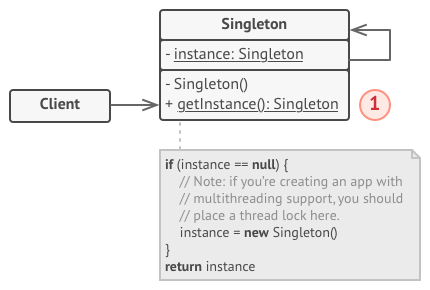

생성 - Singleton
=========

> 날짜 : 2020.02.24

## Singleton 패턴
생성자가 여러 차례 호출되더라도 실제로 생성되는 객체는 하나이고 최초 생성 이후에 호출된 생성자는 최초의 생성자가 생성한 객체를 리턴한다. 즉, 하나의 객체를 메모리에 전역으로 두고 어디에서든 참조하여 사용할 수 있도록 하는 디자인 패턴이다.



### 필요성
Singleton 패턴은 단일책임원칙(SRP - Single Responsibility Principle)을 위반하면서 두 가지 문제를 한 번에 해결해준다.

> SRP 원칙은 코드의 유지보수와 가독성을 높여주는 원칙이지 필수로 지켜야 하는 것은 아니다. SRP뿐 아니라 다른 원칙에도 해당하는 사항임.

1. **클래스가 단 하나의 인스턴스만 갖도록 한다.** 왜 누구나 클래스가 몇 개의 인스턴스를 갖는지 통제하려고 할까? 가장 일반적인 이유는 DB 혹은 파일과 같은 일부 공유 리소스에 대한 액세스를 제어하기 위함이다.<br> 일반적인 생성자는 항상 새로운 객체를 리턴하기 때문에 객체 하나만 갖도록 하지 못한다.

2. **객체가 전역적으로 사용될 수 있게 한다.** 전역으로 변수를 관리하는 것은 편하지만, 코드의 어느 지점에서도 내용을 변경할 수 있기 때문에 위험하다.<br>Singleton 패턴은 전역 변수처럼 프로그램의 모든 곳에서 객체에 접근할 수 있도록 함과 동시에 다른 코드에 의해 값이 변경되는 위험을 방지한다.<br>또 1번에서 언급했듯, 특정 문제를 해결하는 코드가 여러 곳에 퍼져있는 것은 좋지 않다. 많은 클래스에서 해당 코드에 이미 의존하고 있다면 하나의 클래스에 담아두는 것이 훨씬 낫다.

### 구현
싱글톤 패턴의 모든 구현방법은 아래 두 가지의 스텝을 공통적으로 가진다.

- 기본 생성자를 `private`으로 두어 `new`키워드를 통한 새로운 객체가 생성되는 것을 방지한다.
- `static` 메소드를 만들어 생성자처럼 작동하게 한다. 
  
위 두 가지 방법으로만 구현을 간단하게 해본다면..
```java
public class MyPrinter { 
    private static MyPrinter myPrinter;

    private MyPrinter(){}
    public static MyPrinter getMyPrinter(){
        if(myPrinter == null){
            myPrinter = new MyPrinter();
        }

        return myPrinter;
    }
}
```

이렇게 된다. 그러나, 이 코드는 [Thread Safe](../기타/ThreadSafe.md)하지 않은 코드이다. 두 개 이상의 스레드에서 동시에 `getMyPrinter()` 함수를 호출한다면, MyPrinter 클래스의 인스턴스가 하나만 생성된다는 보장이 없다.

이것을 해결하기 위해서는 몇 가지 해결방법이 존재한다.

#### 1. 동기화 이용하기.
```java
public class MyPrinter {
    private MyPrinter myPrinter;
    private MyPrinter() {}

    public static synchronized MyPrinter getMyPrinter(){
        if(myPrinter == null){
            myPrinter = new MyPrinter();
        }

        return myPrinter;
    }
}
```

`syncrhonized` 키워드를 이용하여 `getMyPrinter()` 함수를 동기화한다. 즉, 락을 이용해 thread-safety를 보장하는 방법. 확실하긴 하지만 synchronized의 고질적인 성능문제가 걸림돌이 된다.

#### 2. 인스턴스를 `static` 로 만들어 초기화.
```java
public class MyPrinter {
    private static MyPrinter myPrinter = new MyPrinter();
    private MyPrinter() {}

    public static MyPrinter getMyPrinter(){
        return myPrinter;
    }
}
```

이 방법은 인스턴스를 전역으로 두고 클래스가 메모리에 로드될 때 변수가 초기화되서 프로그램 시작부터 종료까지 메모리에 상주시키는 방법이다.(Eager Initialize) 
그러나, 이 방법은 사용되지 않을 경우에도 메모리를 차지하여 효율적이지 않다는 단점이 있다.

#### 3. Lazy Holder
```java
public class MyPrinter {
    private MyPrinter(){}

    private static class MyPrinterHolder{
        public static final PRINTER_INSTANCE = new myPrinter();
    }

    public static MyPrinter getMyPrinter(){
        return MyPrinterHolder.PRINTER_INSTANCE;
    }
}
```

`static`인 Holder 클래스를 만들어, final 변수로 MyPrinter의 인스턴스를 가지고있게 하고, getMyPrinter 호출 시 리턴하는 구조.

Holder 클래스는 MyPrinter 클래스의 `getMyPrinter()` 메서드에서 `MyPrinterHolder.INSTANCE`를 참조하는 순간 Class가 로딩되며 초기화가 진행된다.(Lazy Initialize) JVM이 Class를 로딩하고 초기화하는 시점은 원자성을 보장하기 때문에 volatile이나 synchronized 같은 키워드가 없어도 thread-safe 하면서 성능도 보장한다.


#### 4. Enum
```java
public enum MyPrinter{
	PRINTER_INSTANCE;
  
	public static MyPrinter getMyPrinter() {		
		return PRINTER_INSTANCE;
	}
}
```

가장 심플하고 성능또한 보장하는 구조. Thread-safety와 Serialization이 보장되며, Reflection을 통한 공격에도 안전하다. 그러나, Enum의 초기화는 컴파일 타임에 결정되므로 `Context`라는 의존성이 끼어드는 환경에서는 매 번 Context의 정보를 넘겨 호출하는 비효율적인 상황이 발생할 수 있다. 


### 단점
- SRP원칙을 위반한다.
- 많은 테스트 프레임 워크가 모의 객체를 생성 할 때 상속에 의존하기 때문에 Singleton의 클라이언트 코드를 단위 테스트하기가 어려울 수 있다. 싱글톤 클래스의 생성자는 private하며 대부분의 언어에서 정적 메서드를 재정의하는 것은 불가능하므로 모의 싱글톤 객체를 가져오는 창의적인 방법을 고려해야한다. 

### 참고
- <https://refactoring.guru/design-patterns/singleton>
- <https://medium.com/@joongwon/multi-thread-%ED%99%98%EA%B2%BD%EC%97%90%EC%84%9C%EC%9D%98-%EC%98%AC%EB%B0%94%EB%A5%B8-singleton-578d9511fd42>
- <https://gmlwjd9405.github.io/2018/07/06/singleton-pattern.html>