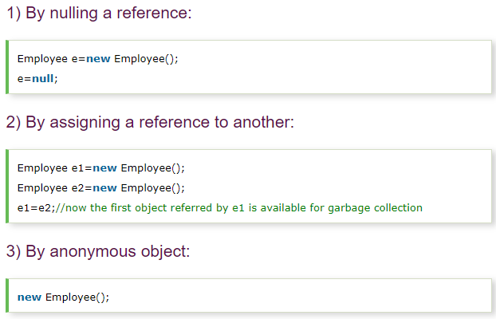

Java Garbage Collection - Garbage Collection Basics
=========

> 날짜 : 20.01.21

Java의 유용한 기능 중 하나인 Garbage Collection (이하 GC 또는 gc)이 어떻게 동작하는지 이해하여 효율적인 메모리 관리를 하기 위함.

## Java에서 Garbage Collection의 정의
자바의 gc는 자바 프로그램 실행 중에 자동으로 메모리를 관리해주는 프로세스이다.
자바 프로그램은 코드를 컴파일하여 바이트코드로 변환 후 JVM위에서 실행된다.
JVM 위에서 프로그램이 실행중일 때 객체들은 heap에 생성이 된다.

 출처 : https://d2.naver.com/helloworld/1230

나중에는, 필요없는 객체가 생기는데 이것을 gc가 찾아서 메모리에서 지워준다.

## Java GC의 동작 방법
GC는 자동으로 이루어지는 프로세스이기 때문에 개발자가 명시적으로 삭제할 객체를 지정할 필요가 없다. 각 JVM은 JVM 스펙에만 맞춰지면 원하는대로 구현이 가능하다. 많은 JVM이 존재하지만, Oracle의 HotSpot이 가장 흔하며, 강력하고 견고한 성능을 보여준다.

HotSpot은 다양한 상황에 맞추어 구현된 여러 개의 GC를 가지고 있으며, 모든 GC는 동일한 기본 프로세스를 따른다.

#### Basic Process
1. *Unreferenced objects* 가 식별되고, gc의 대상으로 표시된다.
2. gc의 대상으로 표시된 객체가 지워진다.
3. 추가적으로, 객체가 삭제된 후 메모리의 공간이 줄어들기 때문에 남은 객체는 힙 시작지점에 연속 블록에 존재한다. 이러한 압축 과정이 새로운 객체가 메모리를 할당받을 때 기존 객체가 존재하던 블록에 연속적으로 할당되기 쉽도록 한다.

> Unreferenced Objects? 
> null을 참조시키거나, 다른 값을 참조시키거나, 익명의 객체 등을 일컫는다.

HotSpot의 모든 GC는 객체를 연령대별로 구분하는 Generational Garbage Collection Strategy를 구현하였다. Generational Garbage Collection Strategy는 대부분의 객체가 오래 살아있지 않고 생성 후 바로 gc의 준비가 될 거라는 것에 근거를 두고있다.

#### 3가지로 구분된 Heap 영역

- **Young Generation** : 새로 생긴 객체는 Young Generation에 속한다. Young Generation은 Eden space와 두 개의 Survivor space로 세분화 된다. Young Generation에 있던 객체가 garbage collect 되면 *minor garbage collection*이라고 한다.
  - Eden Space : 모든 새로운 객체가 시작하는 곳
  - Survivor Space : 한 번 이상의 gc cycle에서 살아남은 객체들이 옮겨지는 곳
- **Old Generation** : 오래 살아남은 객체들은 결국 Young Generation에서 Old Generation으로 옮겨지게 된다. Old Generation에 있던 객체가 garbage collect 되면 *major garbage collection* 이라고 한다.
- **Permanent Generation** : 클래스나 메소드같은 메타데이터들은 Permanent Generation에 저장된다. 더 이상 사용되지 않는 클래스들은 Permanent Generation에서도 gc 될 수 있다.

Full garbage Collection 이벤트에서는, 모든 영역에 있는 사용되지 않는 객체가 gc 된다.

#### HotSpot의 네 가지 GC

- **Serial** : 모든 GC 이벤트가 하나의 스레드 안에서 순차적으로 일어난다. Compaction(메모리 압축과정)은 각 gc가 끝나면 실행된다.
- **Parallel** : 여러 개의 스레드가 minor gc를 위해 사용된다. 그 중 하나의 스레드는 major gc와 Old Generation 영역의 compaction에 사용된다. 또는, Parallel의 변형인 Parallel Old 여러 개의 스레드를 major gc와 Old generation compaction에 사용한다.
- **CMS(Concurrent Mark Sweep)** : 여러 개의 스레드가 **Parallel**과 동일한 알고리즘으로 minor gc를 수행한다. Major gc는 Parallel Old와 같이 멀티스레드로 이루어지지만, CMS는 어플리케이션 프로세스와 동시에 실행되어 *"stop the world"* 이벤트를 최소화시킨다. (stop the world : gc가 어플리케이션의 실행을 중지시키는 것.) Compaction은 일어나지 않는다.
- **G1(Grabage First)** : CMS의 대체로 떠오른 가장 최신의 gc이다. g1은 CMS처럼 병렬성과 동시성을 지니고 있지만, 내부는 오래된 gc와는 상당히 다른 방식으로 돌아가고 있다.

## Java GC의 장점
자바 gc의 가장 큰 장점은 사용하지 않거나 *out of reach*한 객체들을 자동으로 삭제하여 메모리의 가용공간을 늘려준다는 것이다. gc기능이 없는 언어를(C, C++) 이용하는 개발자들은 직접 메모리를 관리하는 코드를 짜야한다.

추가적인 작업이 필요함에도 불구하고, 몇몇 개발자들은 성능과 컨트롤에 있어 좋다는 이유로 GC보다 수동으로 메모리를 관리하는 것이 좋다고 옹호한다. 메모리 관리에 대해서는 논쟁이 계속되고 있지만, GC는 인기있는 많은 프로그래밍 언어의 표준 컴포넌트가 되었다. GC가 성능에 부정적인 영향을 끼치는 경우에 대비하여 자바에서는 GC를 튜닝하여 성능을 개선할 수 있는 다양한 옵션을 제공하고 있다.

## Java GC 활용 모범답안

대부분의 간단한 어플리케이션에서 GC는 개발자가 신경써야 하는 부분은 아니다. 그러나, Java를 보다 능숙하게 다루고싶은 개발자에게는 GC가 어떻게 동작하는지 이해하고 튜닝하는 방법을 알아야 한다.

GC의 기본적인 메커니즘 외에도 Java에서 GC에 대해 숙지해야할 중요한 점은 바로 **GC가 비결정적**이고 런타임 중 언제 발생할지 모른다는 것이다. `System.gc()`나 `Runtime.gc()`와 같은 메소드를 활용하여 힌트를 제공하는 것은 가능하나, GC가 실제로 동작하라는 보장은 없다.

Java GC를 튜닝하는 가장 좋은 접근방법은 JVM에 플래그를 설정하는 것이다. 플래그는 사용할 GC(Serial, G1 등), 힙의 초기 및 최대 크기, 힙 섹션의 크기(Young Generation, Old Generation) 등을 조정할 수 있다. 

이러한 튜닝이 이루어지는 어플리케이션의 특성은 설정에 있어 좋은 초기 가이드가 된다. 예를 들어, Parallel GC는 효율적이지만 *"stop the world"* 주기적으로 이벤트를 발생시키므로 GC를 위한 긴 pause가 허용되는 백엔드 처리에 더 적합하다.
반면에 CMS GC는 pause를 최소화하게 설계되어있어, 반응성이 중요한 GUI 어플리케이션 등에 적합하다.
추가적인 튜닝은 힙이나 section들의 크기를 변경하고 jstat과 같은 툴을 이용해 GC 효율성을 측정해가며 이루어낼 수 있다.

### 참고
- <https://stackify.com/what-is-java-garbage-collection/>