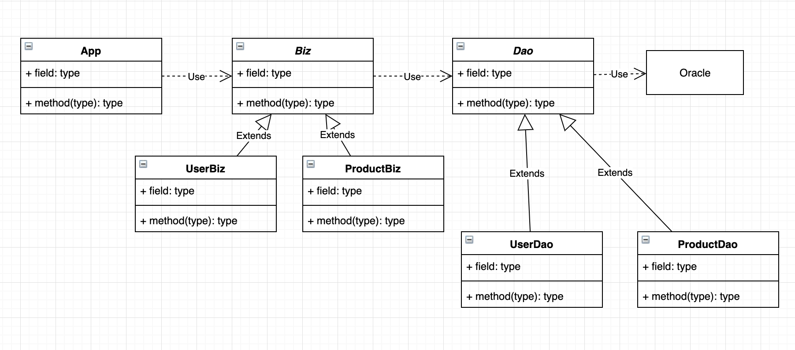

객체지향(OOP) IV
=========

> 과정 12일차 (19.05.28)

### 1. 제어자(Modifier)
- 접근 제한자 : `public`, `protected`, `default`, `private`
- 그 외 : `static`, `final`, `abstract`, `native`, `transient`, `synchronized`, `volatile`, `strictfp`
- final : 마지막, 변경될 수 없는
    - 사용될 수 있는 곳 : 클래스, 메서드, 멤버변수, 지역번수
    - Class의 final : 확장할 수 없는 클래스 (Ex. Math)
    - method의 final : 변경될 수 없는 메서드. Overriding 불가
    - 변수 : 값을 변경할 수 없는 상수가 된다.

- abstract : 추상의, 미완성의
    - 사용될 수 있는 곳 : 클래스, 메서드

- 접근 제한자를 이용한 캡슐화
    - public > protected > (default) > private
    - 접근 제한자를 사용하는 이유 : 외부로부터 데이터를 보호하고 감추기 위해.

---

### 2. 설계(일반적인 Java - DB 연동)


- 위와 같은 구조에서 App과 Oracle 사이에서 Object를 컨트롤할 수 있게 해주는 Biz와 Dao 클래스가 위 시스템의 Frame이다.

- User, Product => 실제 데이터를 설명하고 있는 클래스
- Biz : User, Product와 같은 실제 데이터에 대해 삽입, 삭제, 조회 등의 공통된 연산을 수행하기 위한 클래스 (business logic을 담고 있고 다형성을 위해 만들어진 클래스.) => UserBiz와 ProductBiz로 각각의 클래스에 맞는 객체를 연산
- Dao : DB와 앱을 연결하고, 실제 연산을 진행하기 위한 클래스 (Business logic의 수행 결과를 DB에 반영하거나 DB에서 가져온 결과를 Biz 클래스로 넘겨주기 위한, 다형성을 위해 만들어진 클래스) => UserDao, ProductDao로 각각의 클래스에 맞는 객체를 DB에 연동하여 컨트롤

- 실습코드 : DB(https://github.com/move02/TIL/tree/master/%EC%8B%A4%EC%8A%B5%EC%BD%94%EB%93%9C/db)


### 3. Generic
- 여러가지 타입을 General하게 처리하기 위한 변환 타입.
- Java Collection(List, Map, Set) 과 같이 쓰이거나 클래스에 가변 타입 인자를 전달하기 위해 사용.
```java
class DB<T, U>{
    public abstract void insert(T obj);
    public abstract T select(U obj);
}

class UserDB<User, Integer>{
    public void insert(User obj){
        ...
    }

    public User select(Integer obj){
        return obj;
    }
}

DB<User, Integer> db = new UserDB<>();
```

