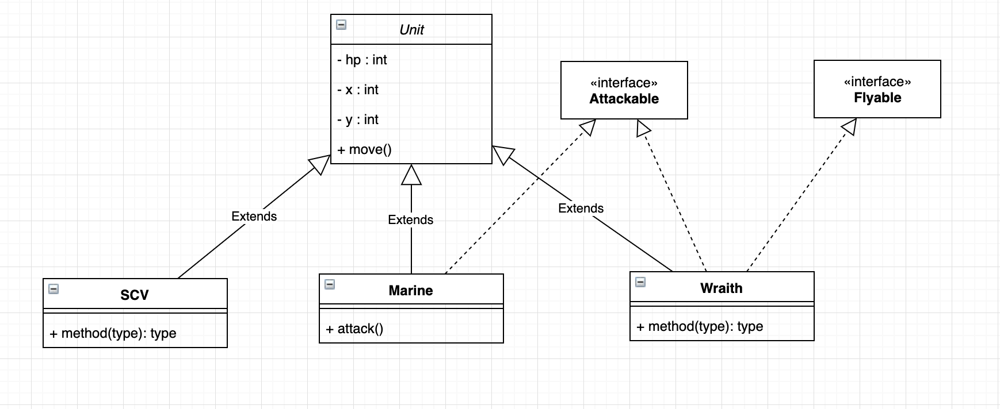

객체지향(OOP) V
=========

> 과정 13일차 (19.05.28)

### 1. 인터페이스
- 추상 클래스이지만, 추상클래스보다 추상화의 정도가 높은 클래스.
- 오직 추상메서드와 상수만을 멤버로 가질 수 있음.
- 구현된 것은 아무것도 없고, 밑그림만 있는 수준.
- **스펙만 정의한 것 -> 클래스의 목적, 기능만을 정의한 것.**
    - 내부 동작은 하위 클래스에서 구현.
    - 기능 명세서의 역할

> 인터페이스 내부에서 정의된 메서드는 abstract 키워드를 붙이지 않아도 됨.

#### 가장 중요한 점
- 단일 상속만 지원하는 Java에서 클래스에 새로운 속성을 추가할 수 있는 수단.
- abstract class는 단 하나의 상속만 받을 수 있지만 interface는 여러 가지를 받아와 구현할 수 있다.

**예시**


```java
public interface Attackable{
    ...
}

public interface Flyable{
    ...
}

public abstract class Unit{
    ...
}

public class Wraith extends Unit 
                    implements Attackable, Flyable{
    ...
}
```

---

### 2. 내부 클래스
- 클래스 내에 선언된 클래스. -> 두 클래스가 서로 긴밀한 관계에 있기 때문에 이렇게 짠다.
- 두 클래스의 멤버들 간 서로 쉽게 접근할 수 있다.
- 외부에는 불필요한 클래스를 감춤으로써 코드의 복잡성을 줄일 수 있다.(캡슐화)

- 종류
    - **Instance Class** : 외부 클래스의 멤버변수 선언 위치에 위치. 외부 클래스의 인스턴스 멤버처럼 다루어짐. 주로 외부 클래스의 인스턴스 멤버들과 관련된 작업에 사용될 목적으로 선언된다.
    ```java
    class A{
        int a;
        class B{
            int b;
            public B(int a){
                b = a;
            }
            ...
        }

        public A(){
            B instanceB = new B(a);
        }
        ...
    }
    ```
    - **Static Class** : 외부 클래스의 멤버변수 선언위치에 선언하며, 외부 클래스의 static 멤버처럼 다루어짐. 주로 외부 클래스의 static 멤버, 특히 static 메서드에서 사용될 목적으로 선언된다.

    - **Local Class** : 외부 클래스의 메서드나 초기화블럭 안에 선언하며, 선언된 영역 내부에서만 사용될 수 있다.

    - **Anonymous Class** : 클래스의 선언과 객체의 생성을 동시에 하는 이름없는 클래스(일회용)
