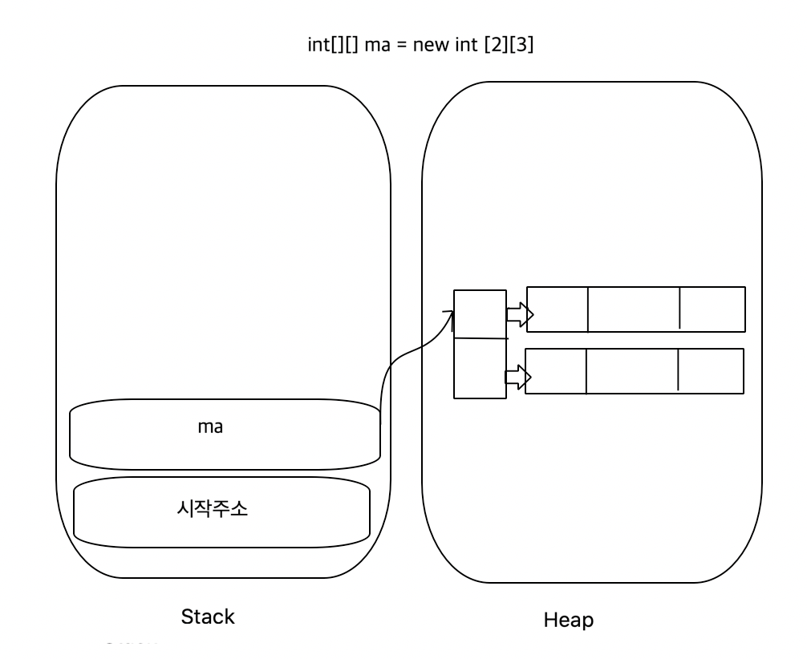

배열
=========

> 과정 5일차 (19.05.17)
> (4일차 학교갔다옴.. // 공부했던 내용은 배열.)

### 1. 2차원 배열

- n 차원의 공간이 생기는 것이 아니라, 배열을 담고있는 배열을 담고있는 배열을..... 이런 식으로 다룸.

> **2차원 배열의 메모리 할당 순서**
> <br>행이 먼저 생기고 열이 각 행의 뒤에 생긴다.
> <br>조금 더 자세히 설명하자면, `int[][] arr = new int[3][4]` 처럼 생성을 할 경우 arr 변수는 배열이 시작되는 주소가 할당되어 스택에 생성이 되고 길이가 3인 행 배열이 힙 메모리에 생성된다.
> 생성된 행 배열은 각각 길이가 4인 열 배열을 가지며 해당 배열의 시작을 가리키는 주소가 할당되고, 실제 값은 열 배열에 할당이 된다.




- 중첩 반복문을 안 쪽 반복문에서 `break` 하고 싶을 때
```java
// 빠져나올 loop를 바깥쪽에서 out 키워드로 지정하고 
// 빠져나오는 조건에서 `break out;`
out:
for(int[] a : numbers){
  for(int data : a){
    System.out.print(a + "\t");
    if(a == 10)
      break out;
  }
}
```

1. Bingo Game을 구현하면서 어려웠던 점.
> 요구사항 및 제약사항
> 1. 빙고 사이즈 입력
> 2. 정방형의 빙고 판을 만들고 1~100까지의 숫자 입력 (중복X)
> 3. 숫자를 입력받아서 입력 받은 값이 있는 곳은 0으로 변경
> 4. 빙고가 되면 표시
> - 빙고는 2차원 배열
> - 배열을 비롯한 지금까지 배웠던 것 이외에 사용 X

- 중복을 허용하지 않게 1 ~ 100까지의 랜덤한 수를 발생시키며 빙고 판에 채워야함
  - 단순한 접근법
  ```java
  int[] numbers = new int[100];
  for(int i = 0; i < 100; i++){
    randomNumber = (Math.random()*100)+1;
    for(int j = 0; j < 100; j++){
      if(numbers[j] == randomNumber){
        i--;
        break;
      }
    }
    numbers[i] = randomNumber;
  }
  ```

  - 위 방법의 문제점 : N이 커질수록 시간 복잡도 증가
  - 다른 방법(checklist) 사이즈가 동일한 checkList에 이미 추가된 숫자의 index라면 true로 바꿈
  ```java
  boolean[] numbersCheck = new boolean[100];
  int[] numbers = new int[100];
  for(int i = 0; i < 100; i++){
    randomNumber = (Math.random()*100)+1;
    if(numbersCheck[i] == true){
      i--;
      break;
    }
    numbers[i] = randomNumber;
    numbersCheck[i] = true;
  }
  ```
  - 위 방법의 문제점 : N이 커지고 반복 횟수가 증가할 수록 checklist에 true인 값이 많아져 randomNumber가 false를 hit할 확률이 현저히 낮아짐.

  - 해결 방법 : 나왔던 숫자를 제외하여 Array를 1사이즈 작게 매 번 다르게 생성
