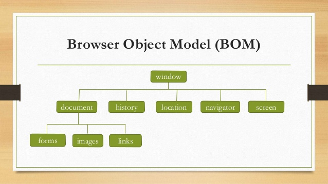

Javascript 2
=========

> 과정 24일차 (19.06.19)

### 제어문
#### 조건문
> 특이사항 없음

#### 반복문
특이점
1. for/in 구문
    - 뒤에 오는 객체의 사이즈만큼 앞의 변수가 1씩 증가.
    ```js
    var iterable = ["a", "b", "c", "d", "e"];
    for(var i in iterable){
        console.log(i);
        // 0,1,2,3,4
    }
    ```
2. for/of 구문
    - 뒤에 오는 iterable 객체를 하나씩 받아와서 반복
    ```js
    var iterable = ["a", "b", "c", "d", "e"];
    for(let i of iterable){
        console.log(i);
        // a,b,c,d,e
    }
    ```

### 함수
1. javascript의 함수에는 리턴타입이 없다.
2. 함수를 변수에 할당 가능하다.
    ```js
    var a = function(){
        return;
    }
    ```
3. 매개변수에 함수명이 들어갈 수 있다.
    ```js
    function a(){
        return 10;
    }
    function b(){
        return 20;
    }

    function c(i, j){
        return i() + j();
    }
    var result = c(a, b);
    console.log(result); // 30
    ```


### 객체
자바스크립트의 가장 기초적인 자료형은 객체(object)
- 문자열, 수치형, 부울형도 객체처럼 구현되어있음. (Immutable objects)
#### 객체를 생성할 때 주의점
- 다른 언어의 클래스 생성 과정과 비슷하나, 생성되는 것은 객체임
- Constructor를 이용하여 클래스처럼 이용할 것.
    ```js
    var Car = {
        name : "k3",
        color : "red",
        go : function(){
            return this.name + "Go";
        },
        stop : function(){
            return this.name + "stop";
        }
    };
    Car.go(); // OK
    var myCar = new Car(); // Error
    ```
<br>

#### 생성자 함수를 이용하여 객체를 만들 수 있다.
- 멤버를 `var`로 선언하면 private, 멤버를 `this.` 으로 선언하면 public
```js
function Car(model, speed, color) = {
    this.model = model;
    this.speed = speed;
    this.color = color;

    this.go = function(){
        return this.model + "Go";
    }
    this.stop = function(){
        return this.model + "stop";
    }
};
Car.go; // Undefined
var myCar = new Car("k3", 130, "red");
myCar.go(); // k3 Go
```
- 생성자를 이용하여 객체를 생성했을 때 문제점
: 멤버 변수는 객체마다 다른 값을 가지니 당연히 각자 메모리를 차지하는게 맞지만,
 메서드는 똑같이 동작하나 객체가 생성될 때마다 똑같은 기능을 하는 메서드가 **객체가 생성될 때마다 메모리를 차지**한다.
 -> 객체가 아닌 클래스가 메서드를 소유하게 하는 방법으로 해결해야함.
 -> **프로토타입**으로 해결하자


#### 프로토타입
Javascript의 모든 객체는 prototype이라는 숨겨진 객체를 가지고 있음.

생성자 함수와 프로토타입 객체를 이용하여 효율적으로 메서드를 선언하자.
```js
function Point(x, y){
    this.x = x;
    thix.y = y;
}

Point.prototype.getDistance = function(){
    return Math.sqrt(this.x * this.x + this.y*this.y);
}
var p1 = new Point(10,20);
var d1 = p1.getDistance(); // 동일 메모리
var p2 = new Point(10,30);
var d2 = p2.getDistance(); // 동일 메모리
```

- Javascript에서 속성이나 메서드를 참조하는 순서
    1. 객체 안에 속성이나 메서드가 정의되어 있는지 확인.
    2. 객체 안에 정의되어 있지 않으면 객체의 prototype lookup.
    3. 원하는 속성/메서드를 찾을 때까지 **프로토타입 체인**을 따라서 올라감.
    > 프로토타입 객체는 개별 객체에서 시작해서 생성자, Object의 프로토타입까지 연결되어 있다.
    > 프로토타입 체인은 `__proto__`라는 속성을 이용하여 연결되어 있음.
---

## DOM

Document Object Model(문서 객체 모델)
HTML 문서의 계층적인 구조를 트리로 표현한다.

> BOM
> JS에서는 HTML 문서와 웹 브라우저를 객체로 간주하여 처리함. 웹 브라우저를 객체로 표현한 것을 BOM(Browser Object Model)이라고 한다.
> document(DOM)은 BOM의 한 부분이다.
BOM 그림


#### JavaScript에서 DOM Element 가져오기

1. getElementby.. 로 가져오기
2. name으로 가져오기 : 입력 요소(form 안에 있는 element에만 해당.)
```js
<form name="myform">
    id : <input type="text" name="id">
</form>

var id = document.myform.id;
```
3. 부모관계를 이용하여 순회

```js
<div>
    <p>리스트</p>
    <ul>
        <li>a</li>
        <li>b</li>
        <li>c</li>
    </ul>
</div>

var myDiv = document.getElementsByTagName('div')[0];
var myP = myDiv.firstChild;
var myUl = myP.nextSibling;
var firstList = myUl.childNode[0];
```