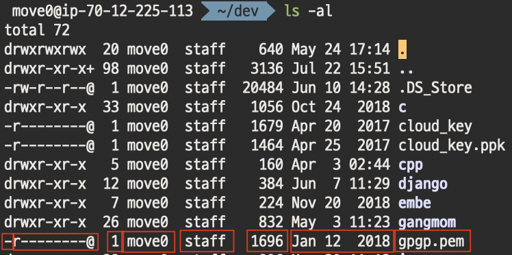

Linux2
=========

> 날짜 : 19.07.22

## 사용자 및 그룹 관리

Linux는 다중 사용자 시스템임.
=> 1대의 머신에 사용자 여러 명이 동시에 접속해서 사용할 수 있는 시스템

같은 권한을 줄 사용자들을 묶어 그룹으로 묶는 것이 일반적인 설정.

### 사용자
`/etc/passwd` : 계정 정보를 보관하고 있는 파일

아래와 같은 형식으로 정보를 서술

```sh
    사용자이름:암호:사용자ID:사용자가 소속된 그룹ID:전체 이름:홈 디렉토리:기본 쉘
```

`/etc/skel` : home 디렉토리의 기본 뼈대를 보관하고 있는 디렉토리
- 사용자 계정이 만들어 질 때 skel 디렉토리 안에 있는 파일의 내용대로 새로운 사용자의 home 디렉토리가 만들어진다.
- 각종 설정파일 (ex. vimrc, zshrc 등)을 넣으면 됨

### 그룹
`/etc/group` : 그룹 정보를 보관하고 있는 파일

아래와 같은 형식으로 정보를 서술

```sh
    그룹 이름:비밀번호:그룹id:그룹에 속한 사용자 이름
```

### 파일과 디렉토리의 소유, 허가권

리눅스의 파일 및 디렉토리는 각각 소유권(Ownership)과 허가권(Permission)이라는 속성이 있음.



(위 빨간 네모박스 순서대로)
1. 파일 유형
    - 디렉토리 : d
    - 일반 파일 : -
    - 블록 디바이스 : b
    - 문자 디바이스 : c
    - 링크 : l
2. 파일 허가권(Permission)
    - 소유자, 그룹, 그 외 사용자 순으로 3개 씩 끊어서 인식.
        - r : **r**ead
        - w : **w**rite
        - x : e**x**ecute
    - 숫자로 표현하면 각 자리를 2진수로 표현한 수치를 다 더한 값이 소유자,그룹,그 외 사용자 순서의 허가권
        > ex) rw-r--r-- 은 세 자리 단위로 끊어서 4,2,0 | 4,0,0 | 4,0,0 이므로 644가 숫자 표현이 된다.

    - **!중요** : 디렉토리는 실행 권한이 반드시 있어야 해당 디렉토리로 이동 가능.
    - `chmod` 명령어로 권한을 변경할 수 있다.
3. 링크 수 : 파일에 걸린 링크의 수
    하드 링크(Hard Link)와 심볼릭 링크(Sumbolic Link) 2가지로 구분.
    - Hard Link : 같은 inode를 사용하는 파일을 생성하여 물리적으로 같은 위치를 가리키는 링크
    - Symbolic Link : 새로운 inode를 만들어, 원본 파일을 가리키는 포인터를 데이터로 갖는 링크
4. 파일 소유권
    파일을 소유한 사용자와 그룹을 의미함.
    - `chown`으로 소유자 변경 및 `chgrp`으로 소유 그룹 변경 가능
