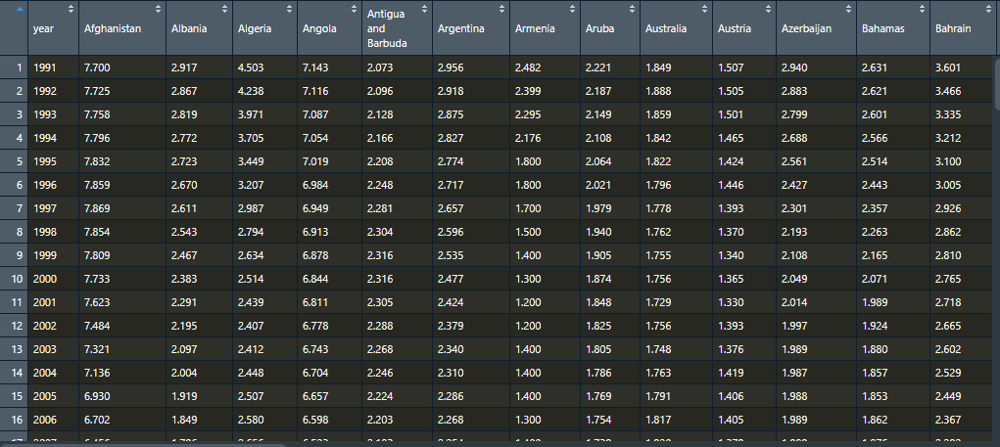
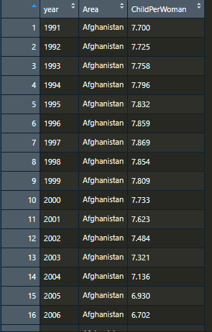

tidyr, dplyr
=========

> 날짜 : 20.02.04

데이터를 다루고 정리하는데에 자주 사용되는 패키지인 tidyr과 dplyr을 정리

### tidy data
데이터를 정제하고 전처리하는 시간을 줄이고자 저장되는 방식에 대해 제안된 개념.
그대로 번역하면 깔끔한 데이터 또는 단정한 데이터 라는 뜻으로, 개념을 고안한 Hadley Wickham의 원문에서 다음과 같이 tidy data의 조건이 정의되어 있다.

1. Each variable forms a column
   1. 각 변수는 개별의 column으로 존재한다.
2. Each observation forms a row
   1. 각 관측치는 row를 구성한다.
3. Each type of observational unit forms a table
   1. 각 테이블은 단 하나의 관측기준에 의해서 조직된 데이터를 저장한다.

예를 들어 날짜가 column name에 들어간다면 wide form이라고 한다. 이것들은 날짜에 해당하는 변수명인 Datetime 등으로 바꾸어 변수로 취급하여 변경해야 한다.

이렇듯 tidy data는 컴퓨터가 읽기 쉬운 형태로 조건을 정의하고 있다.

### tidyr & dplyr
tidyr은 R에서 tidy data를 쉽게 구성하고 다루기 위해 만들어진 패키지이다. 
tidyr은 dplyr패키지에 의존성이 있는데, dplyr은 분해-적용-재조립 전략을 실행할 수 있는 패키지이다.
dplyr은 plyr 패키지의 `data.frame` 전용이라는 의미를 가지며, 데이터 프레임을 처리하는 함수군으로 구성되어 있으나 data.table, 각종 DB, 데이터 큐브 등의 데이터도 핸들링이 가능하다.

| 함수명      | 내용                             |
|-------------|----------------------------------|
| `filter()`    | 행에 조건을 줘서 부분을 추출 |
| `select()`    | 필요한 컬럼만 선택       |
| `mutate()`    | 새로운 컬럼을 계산       |
| `arrange()`   | 조건에 따라 재정렬       |
| `summarise()` | `group_by()`와 함께 사용해 요약값을 계산 |

```r
> cpw_df
#  A tibble: 26,288 x 3
#    area         year   cpw
#    <fct>       <int> <dbl>
#  1 Abkhazia     2010 NA   
#  2 Afghanistan  1991  7.7 
#  3 Afghanistan  1992  7.72
#  4 Afghanistan  1993  7.76
#  5 Afghanistan  1994  7.80
#  6 Afghanistan  1995  7.83
#  7 Afghanistan  1996  7.86
#  8 Afghanistan  1997  7.87
#  9 Afghanistan  1998  7.85
# 10 Afghanistan  1999  7.81
# ... with 26,278 more rows

# filter(data, 필터링 할 조건들)
> filter(cpw_df, year == 2010, cpw >= 4)
# A tibble: 47 x 3
#    area                  year   cpw
#    <fct>                <int> <dbl>
#  1 Afghanistan           2010  5.66
#  2 Angola                2010  6.22
#  3 Benin                 2010  5.10
#  4 Burkina Faso          2010  5.87
#  5 Burundi               2010  6.30
#  6 Cameroon              2010  5.02
#  7 Central African Rep.  2010  4.63
#  8 Chad                  2010  6.60
#  9 Comoros               2010  4.92
# 10 Congo, Dem. Rep.      2010  6.25
# ... with 37 more rows

# arrange(data, 재정렬 할 조건)
> arrange(cpw_df, desc(cpw))
# A tibble: 26,288 x 3
#    area         year   cpw
#    <fct>       <int> <dbl>
#  1 Yemen, Rep.  1991  8.50
#  2 Yemen, Rep.  1992  8.31
#  3 Yemen, Rep.  1993  8.09
#  4 Afghanistan  1997  7.87
#  5 Afghanistan  1996  7.86
#  6 Afghanistan  1998  7.85
#  7 Yemen, Rep.  1994  7.84
#  8 Afghanistan  1995  7.83
#  9 Afghanistan  1999  7.81
# 10 Afghanistan  1994  7.80
# ... with 26,278 more rows

# select(data, 선택할 컬럼명 나열 또는 벡터)
> select(cpw_df, area, cpw)
# A tibble: 26,288 x 2
#    area          cpw
#    <fct>       <dbl>
#  1 Abkhazia    NA   
#  2 Afghanistan  7.7 
#  3 Afghanistan  7.72
#  4 Afghanistan  7.76
#  5 Afghanistan  7.80
#  6 Afghanistan  7.83
#  7 Afghanistan  7.86
#  8 Afghanistan  7.87
#  9 Afghanistan  7.85
# 10 Afghanistan  7.81
# ... with 26,278 more rows

# mutate(data, 추가될 컬럼 = 계산식)
# 각 행에 대한 계산 결과를 하나의 새로운 변수로 만들어줌
> mutate(
+   cpw_df_copy,
+   new_var = round(cpw)
+ )
# A tibble: 26,288 x 4
#    area         year   cpw new_var
#    <fct>       <int> <dbl>   <dbl>
#  1 Abkhazia     2010 NA         NA
#  2 Afghanistan  1991  7.7        8
#  3 Afghanistan  1992  7.72       8
#  4 Afghanistan  1993  7.76       8
#  5 Afghanistan  1994  7.80       8
#  6 Afghanistan  1995  7.83       8
#  7 Afghanistan  1996  7.86       8
#  8 Afghanistan  1997  7.87       8
#  9 Afghanistan  1998  7.85       8
# 10 Afghanistan  1999  7.81       8
# ... with 26,278 more rows

# summarise(data, 변수명 = 계산방법)
# summarise는 일정 조건에 해당하는 계산 수행
# group_by와 같이 사용되는 경우가 많음.
> arrange(                                 # 결과를 avg_cpw가 높은 순으로 재정렬
+   summarise(                             # 결측치(NA)가 있는 행을 제거 후
+     group_by(drop_na(cpw_df), area),     # area를 기준으로 group_by하여
+     avg_cpw = mean(cpw, na.rm = TRUE)    # 평균 cpw를 산출하여 summarise
+   ),
+   desc(avg_cpw)
+ )
# A tibble: 202 x 2
#   area             avg_cpw
#   <fct>              <dbl>
#  1 Niger               5.28
#  2 Mali                4.62
#  3 Somalia             4.37
#  4 Zambia              4.34
#  5 Burundi             4.20
#  6 Nigeria             4.14
#  7 Chad                4.11
#  8 Congo, Dem. Rep.    3.98
#  9 Uganda              3.96
# 10 Malawi              3.94
# ... with 192 more rows
```

### 'wide' vs 'long'
'wide' 형식은 'long' 형식은 데이터에 따라서 가독성에 큰 차이를 가져오기도 한다. 그렇기 때문에 차이점과 변환 방법을 잘 알아야 한다.

#### long 형식
각 칼럼이 변수이고, 각 행이 관측점인 형식.
일반적으로 종속 변수가 하나의 칼럼에만 있고, 다른 칼럼은 독립변수인 경우이다.

#### wide 형식
각 행은 흔히 관측점이며, 동일한 자료형을 담고 있는 다수 관측변수를 갖는다. 데이터 입력이 long 형식에 비해 더 단순하지만, R 함수의 다수는 'long' 형식을 가정하고 설계되어있어 변환을 할 줄 알아야 함.


출처 : https://statkclee.github.io/r-novice-gapminder/14-tidyr-kr.html


### 변환

`gather()` 함수와 `spread()` 함수를 이용하여 상호 변환이 가능하다. tidyr 패키지에 있는 함수이며, tidyr에는 이 외에도 결측치 다루기, 셀 분할 및 결합 등 데이터 프레임 또는 테이블을 가공할 수 있는 함수가 다수 존재함.

```r
library(tidyr)
library(dplyr)
library(stringi)

# 년도, 나라 별 출산 통계 및 예측치 
cpw = read.csv("./r-workspace/chil_per_woman.csv")

# 데이터 수정 (필요한 컬럼만 추출)
# cpw = cpw[, 1:3]
# colnames(cpw) = c("area", "year", "cpw")

head(cpw)
#          area year    cpw
# 1    Abkhazia 2010     NA
# 2 Afghanistan 1800 7.0013
# 3 Afghanistan 1801     NA
# 4 Afghanistan 1802     NA
# 5 Afghanistan 1803     NA
# 6 Afghanistan 1804     NA
# ...........................

# 원 데이터의 연도 범위가 너무 넓어 1990년 이후의 데이터만 설정
cpw = cpw[which(cpw$year > 1990),]

# cpw 컬럼이 결측치인 경우 해당 행을 제외
cpw_long = drop_na(cpw, "cpw")

# head(cpw_long)

# area 컬럼을 wide하게 펼치면서 해당 컬럼의 value는 cpw
# 기본 ID는 남아있는 year 컬럼
cpw_wide = spread(cpw_long, key="area", value="cpw")

# wide로 변환된 테이블을 컬럼명을 바꾸어 다시 long으로 변환.
cpw_another_long = gather(cpw_wide, key="Area", value="ChildPerWoman", colnames(cpw_wide)[2]:tail(colnames(cpw_wide), n=1))
```

##### 변환된 wide


##### 변환된 long



### 참고자료
- https://mrchypark.github.io/data_camp_dabrp/tidyr.html#dplyr-tidyr
- https://wsyang.com/2014/02/introduction-to-dplyr/
- https://gomguard.tistory.com/229
- https://statkclee.github.io/r-novice-gapminder/14-tidyr-kr.html

