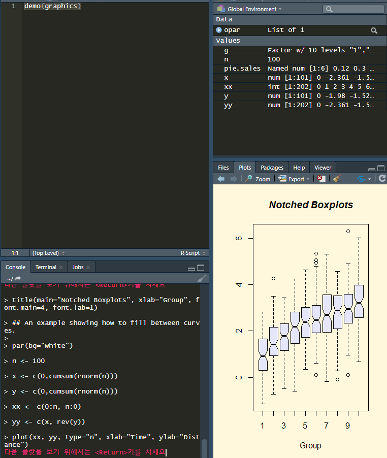

R 기본함수
=========

> 날짜 : 20.01.30

R에서 자주 사용되는 기본함수에 대해 알아본다.

### demo
demo로 미리 지정되어있는 프로그램을 실행한다.

```r
demo(persp)
demo(graphics)
```




### length
다른 언어에 있는 함수와 마찬가지로 자료형의 길이를 리턴한다.

```r
x = c(1,2,3,4,5,6,7)
length(x)              # 7
```

### sum
`sum(x)`는 x의 모든 원소의 합을 구하는 함수이다.

```r
x = c(1,2,3,4,5,6,7,8,9,10)
sum(x)                      # 55
```

### mean
`mean(x)`는 x의 모든 원소의 산술평균을 구하는 함수이다.

```r
x = c(1,2,3,4,5,6,7,8,9,10)
mean(x)                      # 6.173783
```

### max
`max(x)`는 x의 모든 원소 중 최대값을 구하는 함수이다.

### min
`min(x)`는 x의 모든 원소 중 최소값을 구하는 함수이다.

### which
`which` 함수는 특정 값의 위치를 찾을 수 있는 함수이다.
```r
# 기본형태
which(x, arr.ind = FALSE)
```
arr.ind 옵션은 x가 matrix 또는 array 형태일때 사용 가능한데, 디폴트가 FALSE이기 때문에 찾고자 하는 값의 위치를 반환한다.

#### 벡터
벡터에서는 arr.ind 옵션은 무시된다.
무조건 인덱스를 반환.
```r
x = c(2:10)
# [1] 2 3 4 5 6 7 8 9 10

which(x == 3)       # 3이 위치하고 있는 2를 반환
# [1] 2

x[which(x==3)]      # 조건에 맞는 원소 자체를 반환
# [1] 3

which(x%%2 == 0)    # 2로 나눈 나머지가 0인 조건
# [1] 1 3 5 7 9      짝수의 위치를 반환함.

x[which(x%%2 == 0)]
# [1] 1 3 5 7 9      조건에 맞는 원소를 반환.
```

#### matrix (arr.ind 사용)
```r
m = matrix(1:12, 3, 4)

# matrix 형태에서 arr.ind = FALSE가 디폴트.
# 조건에 맞는 원소의 위치가 아닌 원소 자체를 반환.

> which(m %% 3 == 0)
[1]  3  6  9 12

> which(m %% 3 == 0, arr.ind = TRUE) # 조건에 맞는 원소의 위치가 반환됨
     row col
[1,]   3   1
[2,]   3   2
[3,]   3   3
[4,]   3   4
```

#### data frame
```r
> head(swiss) # 내장 데이터인 swiss 사용
             Fertility Agriculture Examination Education Catholic Infant.Mortality
Courtelary        80.2        17.0          15        12     9.96             22.2
Delemont          83.1        45.1           6         9    84.84             22.2
Franches-Mnt      92.5        39.7           5         5    93.40             20.2
Moutier           85.8        36.5          12         7    33.77             20.3
Neuveville        76.9        43.5          17        15     5.16             20.6
Porrentruy        76.1        35.3           9         7    90.57             26.6

> which(swiss$Catholic >= 90)      # Catholic 컬럼이 90 이상인 행의 위치 반환
 [1]  3  6  7  8  9 10 11 31 32 33 34 35 36 37 38

> swiss[which(swiss$Catholic >= 90), ]  # Catholic 컬럼이 90 이상인 행 반환
             Fertility Agriculture Examination Education Catholic Infant.Mortality
Franches-Mnt      92.5        39.7           5         5    93.40             20.2
Porrentruy        76.1        35.3           9         7    90.57             26.6
Broye             83.8        70.2          16         7    92.85             23.6
Glane             92.4        67.8          14         8    97.16             24.9
Gruyere           82.4        53.3          12         7    97.67             21.0
Sarine            82.9        45.2          16        13    91.38             24.4
Veveyse           87.1        64.5          14         6    98.61             24.5
Conthey           75.5        85.9           3         2    99.71             15.1
Entremont         69.3        84.9           7         6    99.68             19.8
Herens            77.3        89.7           5         2   100.00             18.3
Martigwy          70.5        78.2          12         6    98.96             19.4
Monthey           79.4        64.9           7         3    98.22             20.2
St Maurice        65.0        75.9           9         9    99.06             17.8
Sierre            92.2        84.6           3         3    99.46             16.3
Sion              79.3        63.1          13        13    96.83             18.1
```

### runif
랜덤으로 숫자를 생성해주는 함수.
```r
# 기본형태
runif(n, min = 0, max = 1)

# min, max의 기본값은 0, 1이다.
# 생성되는 숫자는 double 이고, 정수로 만들기 위해서는 floor, ceiling 등과 같은 함수를 사용하면 된다.

# 주사위 1000번 던지기
a = floor(runif(1000, min=1, max=6))

```
