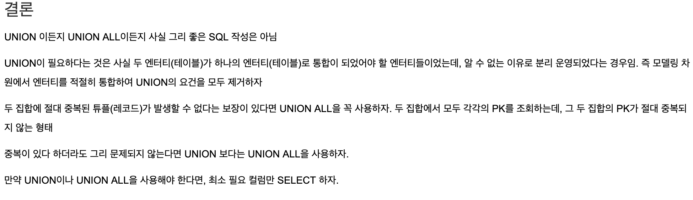

SQL
=========

> 과정 16일차 (19.06.03)

### 1. 집약 함수(Group function)
- DBMS에서 제공하는 기능
> ? DBMS에서 제공하는 함수를 쓰는게 나을까 불러와서 language 단에서 계산을 하는게 나을까?

- 기본적으로 집약 함수를 사용할 때에는 NULL인 행은 계산하지 않는다.(0으로 치환하는것이 아니라 무시함) // 단. COUNT(*)은 예외.

종류
- COUNT : 조건을 통해 나오는 행의 갯수를 출력.
- SUM : 행 값의 총 합.
- AVG : 행 값의 평균.
- MAX : 최댓값.
- MIN : 최솟값.
    > MIN과 MAX는 날짜에 대해서도 가능하다.

- DISTINCT를 사용한다면 중복값을 제외하고 출력이 가능하다.
```sql
SELECt COUNT(DISTINCT JOB) FROM EMP;
```

### 2. 그룹(Grouping)
- 집약 함수(group function)와 함께 사용하여 데이터를 그룹 별로 묶기 위해 사용한다.

구문
```sql
SELECT JOB, COUNT(*) FROM EMP
ORDER BY JOB;

SELECT <col1>, <col2>, ... FROM <table>
GROUP BY <col1>, <col2>, ...
```

- 그루핑을 두 번(혹은 그 이상) 하여 데이터를 두 개 이상의 그룹으로 묶을 수 있다.
- ex.
```sql
SELECT DEPTNO, JOB, SUM(SAL) FROM EMP
GROUP BY DEPTNO, JOB
ORDER BY DEPTNO;
```

- Grouping 후 조건을 주고싶을 때 => `HAVING` 키워드를 사용.
- 단 `HAVING` 의 조건에 사용되는 column은 select 절에서 가져오기로 한 column만 가능.
```sql
SELECT <col1>, <col2>, ... FROM <table>
GROUP BY <col1>, <col2>, ...
HAVING <condition>;
```
- `WHERE`과 `Having`을 같이 사용할 수도 있지만, `WHERE`는 GROUP BY 전에 사용하고 HAVING은 이후에 사용한다.


### Rollup

정의 : ROLLUP은 GROUP BY 절과 같이 사용 되며, GROUP BY절에 의해서 그룹 지어진 집합 결과에 대해서 좀 더 상세한 정보를 반환하는 기능을 수행 한다.

ex)
```sql
SELECT b.dname, a.job, SUM(a.sal) sal, COUNT(a.empno) emp_count 
FROM emp a, dept b
WHERE a.deptno = b.deptno
GROUP BY ROLLUP(b.dname, a.job) 
-- Rollup을 통해 부서별, 직업별 합계(sal, count(empno))를 쉽게 구할 수 있음.
```

---

### 3. 뷰(VIEW) & 서브쿼리(SubQuery)
#### VIEW
- SELECT 문 그 자체. => 내부적으로 SELECT 문을 실행하여 일시적인 가상 테이블을 만들어 보여주는 것.
- 데이터를 저장하지 않기 때문에 저장공간 절약 가능.
> SELECT 문을 저장해두고 불러올 때 마다 내부에 저장된 SELECT문을 실행한다고 생각하자. => 원래 테이블의 데이터가 변경되면 똑같이 변경된 데이터를 가져올 수 있다.

- SQL 입장에서는 table과 동일하게 취급
- ex. View의 생성방법
```sql
CREATE VIEW DEPTSAL (DEPTNO, AVGSAL)
AS
SELECT DEPTNO, AVG(SAL) FROM EMP
GROUP BY DEPTNO;
```

#### SubQuery
- 서브쿼리 == 일회용 뷰
- 뷰 정의 SELECT 문을 그대로 FROM 혹은 WHERE 절에 삽입한 것.

- 스칼라 서브쿼리(Scalar Subquery)
    - **반드시 1행 1열만을 반환 값으로 반환한다** 라는 제약을 가진 서브쿼리
    - WHERE 구에 스칼라 서브쿼리를 사용한다.
    - 단일 Value를 반환해야만 한다.

- 상관 서브쿼리(Correlated Subquery)
    - 같은 분류 내의 속성과 비교를 할 때 사용된다.
    ```sql
    -- 같은 직종 내 평균치 임금보다 많이 받는 근로자.
    SELECT JOB, ENAME, SAL FROM EMP E1 
    -- ORACLE에서는 EMP E1으로 쓰고 나머지 DBMS 에서는 EMP AS E1으로 쓴다.
    WHERE SAL > (
        SELECT AVG(SAL) FROM EMP E2
        WHERE E1.JOB = E2.JOB -- 결합조건
        GROUP BY JOB
    );
    /* E1의 출력 결과로 나온 각 Row의 JOB과 E2의 JOB을 비교하여
    같은 직종만 선택하여 리턴한다.
    */
    ```
    <br>
    
    - 결합조건은 서브쿼리 내에서만 사용되어야 한다.
    ```sql
    -- 같은 직종 내 평균치 임금보다 많이 받는 근로자.
    SELECT JOB, ENAME, SAL FROM EMP E1 
    WHERE E1.JOB = E2.JOB -- 결합조건이 서브쿼리 밖에서 사용되었기 때문에 에러.
    WHERE SAL > (
        SELECT AVG(SAL) FROM EMP E2
        GROUP BY JOB
    ); 
    ```

<br>

### 4. 조인(Join)

정의 : 논리적 관계를 기준으로 둘 이상의 테이블에서 데이터를 검색하기 위한 방법 

- 내부 조인(Inner Join) : 두 테이블에 공통적으로 존재하는 것을 찾을 때
- 외부 조인(Outer Join)
    - **Left Outer Join** : 왼쪽 테이블을 기준으로 검색을 하는 것. 즉, 왼쪽 테이블의 값들은 모두 출력하고 오른쪽 테이블에서는 조인 조건에 맞는 값들은 출력, 왼쪽 테이블을 기준으로 오른쪽 테이블에 존재 하지 않는 값은 NULL로 검색이 됨.
    - **Right Outer Join** : Left outer join과 반대
    - **Full Outer Join** : 기준없이 전부 조인하여 출력.

### 5. Union
정의 : 두 개 이상의 SELECT문 실행 결과를 합치는 것. (합집합)
- `UNION` : 중복이 제거된 합집합 결과. (UNION DISTINCT)
- `UNION ALL` : 중복이 제거되지 않은 합집합 결과.

그러나...


출처 : https://brownbears.tistory.com/126