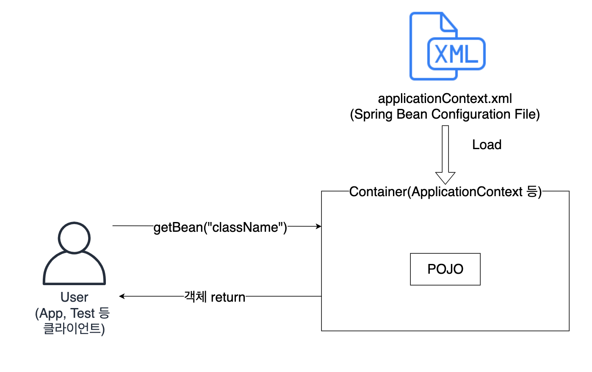

Spring I
=========

> 과정 33일차 (19.07.02)

### What is Spring?

**자바 기반의 프레임워크** (처리 영역에 따른 구분)
- **Presentation** (View)
    - Struts
    - Spring(MVC)
- **Business** (Controller)
    - Spring(IoC, AOP)
- **Persistence** (Model)
    - Hibernate or JPA
    - Ibatis or Mybatis

**Component Model vs POJO**
- Component Model
    - Servlet on Container(Tomcat 등)
    - MobileApp on Container(Android)
    - 등등

> POJO란?
> Plain Old Java Object의 약자로, 평범한 옛날 자바 객체를 의미함.
> 규칙대로 작성해야하는 Servlet과 반대됨.
> Spring의 가장 큰 특징 중 하나로, 기존에 만들었던 클래스를 Spring의 Container 위에서 별 다른 수정없이 실행 가능.
> => 재사용성이 증가

#### Spring Framework의 장점
- **경량**
- **IoC(Inversion of Control)** : 제어의 역행 -> 낮은 결합도(아래에 자세히 정리)
- **AOP(Aspect Oriented Programming)** : 공통으로 사용하는 기능들을 외부의 독립된 클래스로 분리하고, 해당 기능을 프로그램 코드에 직접 명시하지 않고 선언적으로 처리하여 적용하는 것.

### IoC(Inversion of Control) 컨테이너
IoC란? 
- 제어의 역전
- 객체의 생성이나, 메소드의 호출이 개발자가 아닌 외부에 의해 결정되는 것.
- 개발자가 의도한대로 흘러가는 프로그램이 아닌, 사용하고자 하는대로 사용가능한 프로그램.
- 모델 간 결합도가 낮추는 패턴이자, 컨테이너

> *뜬금*
> Eclipse에서 Spring 프로젝트를 만드는 방법
> 1. Project 생성
> 2. Spring Nature 주입
> 3. Maven으로 Spring Library 추가
    - pom.xml (필요한 라이브러리 나열)
    - Maven에서 자동으로 라이브러리 설치

**Spring Container(IoC 컨테이너)의 동작 순서**

1. 클라이언트(User)가 Spring 설정 파일을 로딩하여 컨테이너 구동.
2. Container는 SpringBeanConfigurationFile에 등록된 Bean 생성.
    - ApplicationContext 클래스로 만들어진 Container -> Pre-loading이 default
    - BeanFactory 클래스로 만들어진 Container -> Lazy-loading이 default
    - 바꾸고 싶다면, bean 태그에 lazy-init 속성을 "true", "false"로 바꾸어주면됨.
3. `getBean()` 메소드로 객체 요청(Lookup)
4. 객체(POJO) 반환

> Application Context의 구현 클래스
> - GenericXmlApplicationContext : 파일 시스템 혹은 클래스 경로에 있는 XML 설정 파일을 로드하여 구동하는 컨테이너.
> - XmlWebApplicationContext : 웹 기반의 스프링 어플리케이션을 개발할 때 사용하는 컨테이너

**bean의 속성**
!! 나중에 따로 정리할 것!!

### 의존성 주입 (Dependency Injection)
#### 의존성 관리
Spring은 객체의 생성과의존관계를 컨테이너가 자동으로 관리함. -> IoC의 핵심 원리

IoC의 두 가지 지원 형태
- Dependency Lookup
    - 의존성 검색
    - IoC 컨테이너에 존재하는 객제 저장소(Pool)에서 객체를 검색하여 참조하는 방법.
    - 컨테이너가 제공하는 API(`getBean()` 등)를 이용하여 의존성 객체 획득
    - Dependency Pool
    - Contextualized Dependency Lookup
- Dependency Injection
    - 

**의존성 관리를 사용하는 이유**
- 의존관계가 있는 객체 객체 생성 코드를 메소드에서 호출할 경우
    - 호출될 때마다 각자 다른 객체 생성
    - 기존 Class를 다른 Class로 바꾸기 위해서는 의존관계에 있는 Class의 코드(객체 생성코드가 들어있는 메소드)도 수정해야함.
    - 위와 같은 문제가 있음.

- Spring에서는 이를 의존성 주입을 이용하여 해결함.
