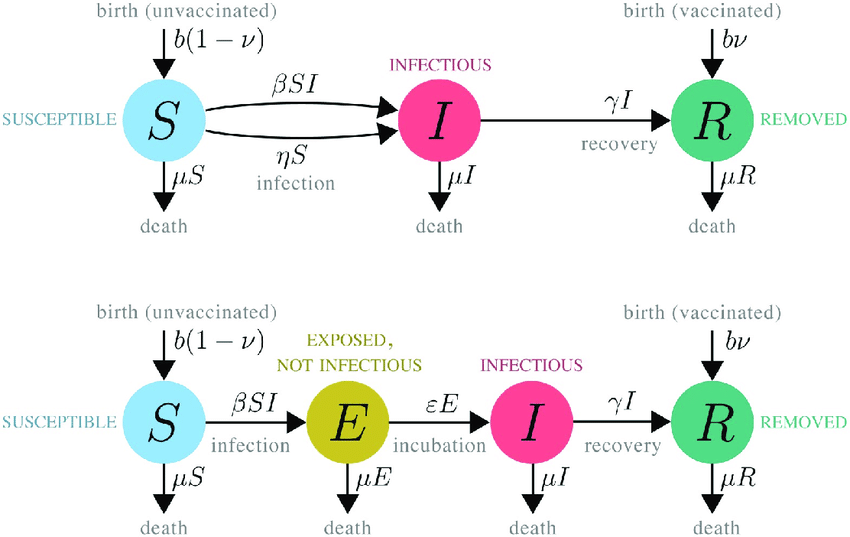

Stem 이란
=========

> 날짜 : 20.03.24

질병을 모델링 할 수 있는 도구인 Stem에 대해서 공부하게 되었다.
Stem이 무엇인지 정리해보고, 기본적인 사용법에 대해 알아본다.

## 개요
IBM에서 처음 개발하고, Eclipse 재단으로 넘어와 오픈소스로 개발중인 Stem은 Spatio-Temporal Epidemiological Modeler의 약자이다. 그대로 번역하자면 *시공간 역학 모델러* 정도 되는데 무슨 말인지 도무지 감이 안온다.
Youtube에 나온 Stem 소개영상(https://www.youtube.com/watch?v=LfiibQX4IFE)에 따르면 다음과 같다.

**질병에 대한 공간적, 시간적 모델을 구성하기 위한 툴이자 프레임워크**

무엇을 위해 만들어졌는지 정도는 알 것 같다. 그렇다면, 질병을 예측하기 위해서는 어떤 데이터가 필요할까?

### 알고싶은 것
- 서울에서 열 건의 신종 인플루엔자가 발생했을 때 부터, 부산에서 발병률이 정점을 찍을 때까지 얼마나 걸릴 지 알고 싶다.
- 이 때, 발병 기간 동안 총 몇 건의 감염이 일어날 지 예측하고 싶다.
- 추가적으로 "사회적 거리두기"같은 정책들에 의해 어떤 다른 결과가 나타날 지 알고 싶다.

### 필요한 것
필요한 것은 크게 두 가지로 나뉜다.
- Denominator data(배경 데이터)
  - 서울과 부산에 몇 명의 사람이 살고있는지?
  - 서울과 부산 사이를 왕복하는데 몇 가지 방법이 있는지? (고속도로, 국도, 공항, 기차 등등)
  - 배경이 되는 데이터
- Disease model(질병 모델)
  - 질병의 특성은 무엇이 있는지?
    - 바이러스의 전염확률(혹은 복제 확률)은 어느 정도인지?
    - 감염되었을 때 회복까지 얼마나 걸리는지?(완치율)
    - 면역력이 얼마나 지속되는지?(면역 손실율)
    - 질병의 사망률은 얼마나 되는지?
  - 얼마나 되는 인구가 평균적으로 이 새로운 질병에 저항이나 면역력이 있을지?

STEM은 위 두 가지 데이터를 고급 수학 기법을 이용하여 모델링하고 각 모델 간 상호작용 등을 시뮬레이션할 수 있도록 하는 도구이다.

STEM은 거의 모든 국가의 GIS 데이터를 내장하고 있으며, 국경, 인구, 공유 국경(이웃), 주간 고속도로, 주 고속도로 및 공항에 대한 데이터가 제공된다.(Denominator Data)

## 전염병 모델링
모델은 일반적으로 체계(또는 개체 시스템)가 어떻게 작동하는 것인가를 설명하는 개념적인 도구로 생각할 수 있다. 

역학(epidemiology)에 적용되는 수학모형은 작게는 각각의 병의 요인부터 크게는 유행역학(유행병)을 예측하게 하고, 또한 어떤 유행 양상을 띌지, 감염의 전파에 백신 등이 미치는 영향을 예측 가능하게 한다.

감염병의 모델링은 대부분 Multi Compartment Model을 기반으로 하고있다.
대표적인 모델로는 아래의 두 개의 모델이 있다.
- SIR 모델
  - Susceptible(영향을 받을 수 있는 상태 - 미감염)
  - Infectious(감염 상태)
  - Recovered(회복)
- SEIR 모델
  - Susceptible(영향을 받을 수 있는 상태 - 미감염)
  - Exposed but not yet infectious(감염되었지만 전염성이 없는 상태)
  - Infectious(감염 상태)
  - Recovered(회복)

STEM에서는 위 두 가지를 포함한 Multi Compartment Model을 기반으로 다양한 확장형 모델을 제공하고 있다.

## 결론
STEM은 각 국가의 GIS 데이터를 포함한 모델, 항공이동 모델, 국가 별 인구모델, 기본 전염병 모델 등 다양한 Denominator Data를 보유하고있고, 고급 수학 기법 등을 이용해 모델 간 상호작용을 시뮬레이션할 수 있도록 하는 프레임워크이다.

시간이 된다면 STEM wiki를 한국어로 번역해서 올려봐야겠다.

### 참고자료
- [감염병과 수학모형: SIR 모형과 SEIR 모형](http://www.cdc.go.kr/CDC/cms/content/mobile/16/12516_view.html)

