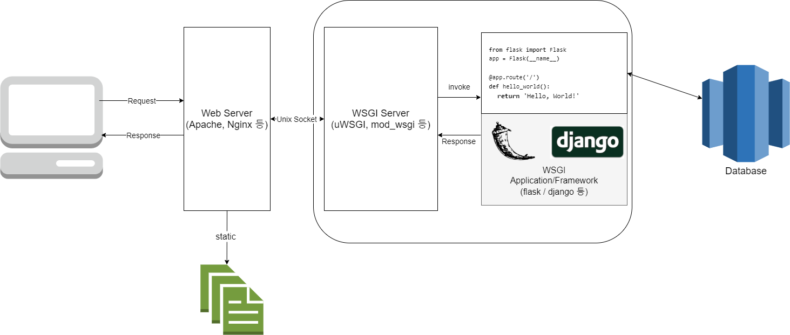

WSGI란
=====

> 날짜 : 2020.06.26

회식자리에서 얘기하던 중 스프링(전자정부) 프레임워크외에 가벼운 프레임워크를 찾으시던 선임에게 flask를 추천해드렸다.
Micro Framework이기 때문에 초기 세팅이 가볍고 확장성이 좋기 때문.
flask에 대해 설명을 하다가 java 진영의 Tomcat처럼 WAS의 역할을 하는 것은 무엇이냐 라고 물어보셔서 WSGI에 대해 설명드리기 위해 작성한다.

## 개념
WSGI는 Web Server Gateway Interface의 약자로 웹 서버가 웹 어플리케이션과 어떻게 커뮤니케이션을 주고받는지, 웹 어플리케이션이 요청을 처리하기 위해 어떻게 동작되어야 하는지에 대한 명세(PEP333)이다. 결국, 웹 서버와 웹 어플리케이션 사이에 들어올 미들웨어는 이런이런 기능을 가지고 있어야 해! 라는 명세인것이다.
WSGI 자체가 파이썬 진영에서 CGI를 확장하여 나온 개념이고, 파이썬 기반 웹 프레임워크는 대부분 WSGI를 지원한다.

### 조금 더 자세하게
PEP333에서 WSGI를 서버/게이트웨이, 웹 어플리케이션/프레임워크 두 개의 측면으로 나눈다.
서버단에서는 환경정보와 콜백함수를 웹 어플리케이션단에 제공해야 한다.
웹 어플리케이션은 그 요청을 처리하고 미리 제공된 콜백함수를 통해 서버단에 응답한다.

WSGI 미들웨어 WSGI 서버와 웹 어플리케이션 사이를 보충하는 역할을 하는데 이 미들웨어는 서버의 관점에서는 어플리케이션으로, 어플리케이션의 관점에서는 서버처럼 행동한다. 

WSGI 서버는 Gunicorn, uWsgi, mod_wsgi 등이 있으며, WSGI 어플리케이션(callable 객체 포함 등의 조건)과 인터페이스를 지원하는 프레임워크는 Flask, Django 등이 있다.

## WAS vs WSGI
"그래면 WSGI가 WAS 역할을 하는거야?" Java 진영 개발만 해온 사람들은 당연히 이런 의문이 들 수 있다. 
내 대답은 "가능하다" 정도일 것이다. 엄밀히 따지면 WAS는 웹서버에서(또는 직접) 요청을 받아 서블릿 등을 통해 웹 어플리케이션을 동작시키는 프로그램이고, WSGI는 단순한 specification이니까 말이다. 그러나, uWSGI등과 같은 구현체 역시 tomcat처럼 Web Server을 겸임하기도 한다. 그러므로, 웹 프레임워크 위에서 개발하는 개발자 입장에서는 그렇게 보아도 무방하다 정도로 대답할 수 있을 것 같다.

## 구성도
앞서 알아본 wsgi를 앞으로 구현하게 될 시스템의 대략적인 아키텍쳐로 생각하며 그려보았다.

## 마무리
장고로 개발하면서 많이 써보기도 했지만, 정작 사용해본 내가 이게 뭔지 몰랐다는게 부끄러웠다. 내가 wsgi서버나 미들웨어의 명세를 보고 구현해야 할 필요는 없지만 무슨 역할을 하는지, 어떤 구조로 되어있는지 알게 되니 개발할 시스템의 큰 그림을 그리기 수월해진듯 하다.

처음으로 PEP 문서를 읽어봤는데 JPA도 그렇고 사용하는 기술의 Specification에 대해 한 번은 읽어보는 것이 좋을 것 같다.