Git 간단 정리
=====

Git을 처음 사용하는 사람들에게 git이 무엇인지 부터 하나의 저장소를 이용하여 소규모 팀이 협업하는 과정까지 소개와 간단한 실습을 담는 문서입니다.


## Git이란?
깃은 리눅스의 개발자인 리누스 토발즈에 의해 개발된 분산 버전 관리 시스템(VCS)입니다. 
git과 더불어 VCS의 대표주자로 SVN이라는 툴이 있습니다. 

### Git vs SVN
Git과 SVN은 같은 VCS이지만 굉장히 큰 차이를 가지고 있습니다.
간단하게 몇 가지 큰 차이점만 알아보자면..
- SVN(중앙집중형)
    - 서버에 원본을 두고, 사용자가 이 서버의 원본을 받아와 수정 후 서버에 다시 올리는 형태입니다. 
    - commit 자체가 내가 개발한 것을 공개한다는 의미가 됩니다.(직관적이라는 장점이 있습니다)
    - 자신만의 commit history를 가질 수 없습니다.
    - 중앙 집중형이기 때문에 서버에 문제가 생기면, 복구가 어렵습니다. 
    - commit한 내용에 실수가 있을 시 다른 개발자에게 바로 영향을 미치게 됩니다.
- Git(분산형)
    - 원격 저장소가 있다는 것은 동일하지만, 로컬 저장소가 따로 존재합니다.
    - 자신만의 commit history를 가질 수 있습니다.
    - 개발자가 원하는 타이밍에 원하는 버전까지만 push할 수 있습니다.
    - 로컬 저장소의 존재 때문에 굳이 서버에 연결되어있지 않더라도 이력을 관리할 수 있습니다. (+ 빠른 속도를 보장합니다.)

위의 차이점으로 미루어보아 Git은 SVN에 비해 유연하고 로컬환경에서도 작업이 가능하다는 장점이 있다는 것을 알 수 있습니다. (실제로는 더 많은 장점을 가지고 있다고 생각합니다.)

그러면 이제 본격적으로 git으로 버전관리를 어떻게 하는지 알아보겠습니다.

---

## Git 혼자 사용해보기
우선, git과 github을 이용해서 간단하게 개인 프로젝트를 관리 해보겠습니다.

### 환경세팅
#### 윈도우
[다운로드 링크](https://git-scm.com/download/win) https://git-scm.com/download/win 에 들어가셔서 자신에게 맞는 설치파일을 다운받아 주세요.

설치 과정은 [이 블로그](https://wonderbout.tistory.com/64) https://wonderbout.tistory.com/64 를 참고해주세요. (기본설정으로 next만 눌러도 큰 무리없이 설치가 됩니다.)

#### Mac
두 가지 옵션이 있습니다.
1. https://git-scm.com/downloads 에 가셔서 Mac OS X 용 dmg를 다운받으셔서 pkg 파일을 실행하시면 됩니다.
2. Homebrew가 설치되어있다면 다음 한 줄로 설치가 가능합니다. 
```
brew install git
```

### 기본적인 workflow(혼자 사용할 때)
git의 기본적인 workflow를 기본적인 명령어와 함께 알아보겠습니다.


#### Git을 처음 시작할 때
1. **git 저장소를 시작합니다.**

    작업을 하고있는 디렉토리를 workspace로 지정하고 local repository를 통해 관리하겠다는 의미입니다.
    
    `git init`이라는 명령어를 터미널에서 실행.
    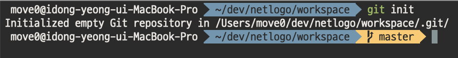

    eclipse에서는 프로젝트 우클릭 > Team > Share Project로 시작합니다.
    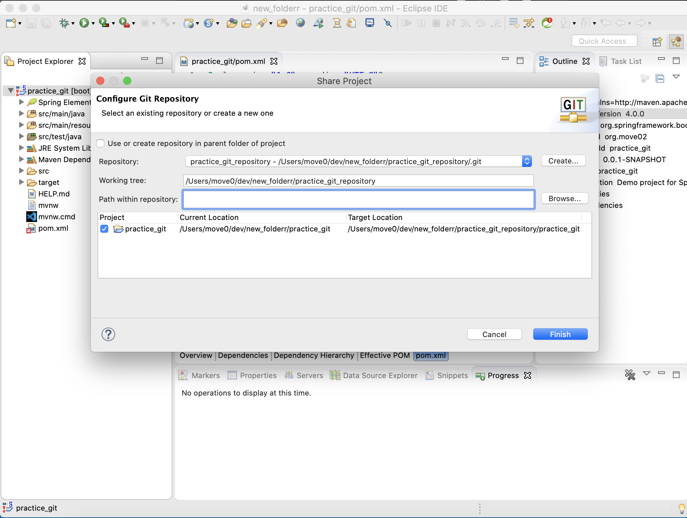
    local repository는 eclipse workspace와 동일한 곳에 하는것을 추천하지 않기 때문에 workspace와 다른 위치에 만들어주었습니다.

    > 보통 IDE나 프레임워크를 이용하는 프로젝트에서는 workspace에 git으로 관리하지 않아도 되는 결과물들이 포함되어 있습니다. (ex. target폴더, eclipse 환경설정 폴더 등) 이러한 파일들은 git이  변경사항을 추적하지 않도록 .gitignore 라는 파일을 작성하여 불필요한 변경점을 방지하는 것이 좋습니다.
    > gitignore는 http://gitignore.io/ 이 사이트를 이용하면 간편하게 작성할 수 있습니다.


2. **파일들을 staging 합니다.**
    1. staging이라는 작업을 통해 git이 추적하고있지 않은 파일이나 수정된 파일 등을 commit의 대상으로 올립니다.
    2. 이를 통해 수정이 되었어도 commit 대상에서 제외시킬 수 있습니다.
    3. staging 자체를 취소할 수도 있습니다. 
    
    `git add [파일명]` 명령어를 터미널에서 실행합니다.
    파일명 자리에 `.`을 붙이면 untracked 또는 modified 상태인 파일들을 모두 staging 합니다.
    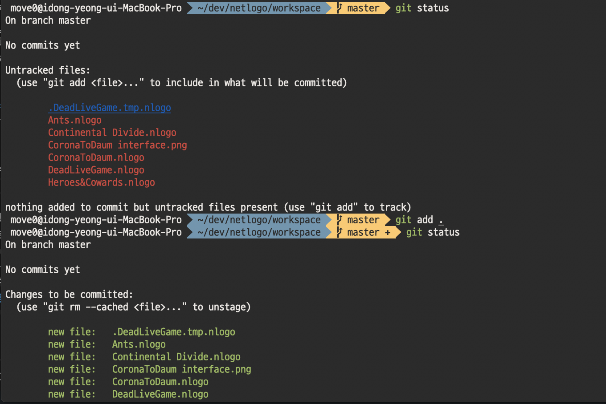

    > git status 명령어를 통해 중간중간 workspace의 상태를 체크하는 모습이 포함되어 있습니다.

    eclipse에서는 Team > commit을 통해 아래와 같은 메뉴에서 상태 확인 및 스테이징과 커밋을 할 수 있습니다.
    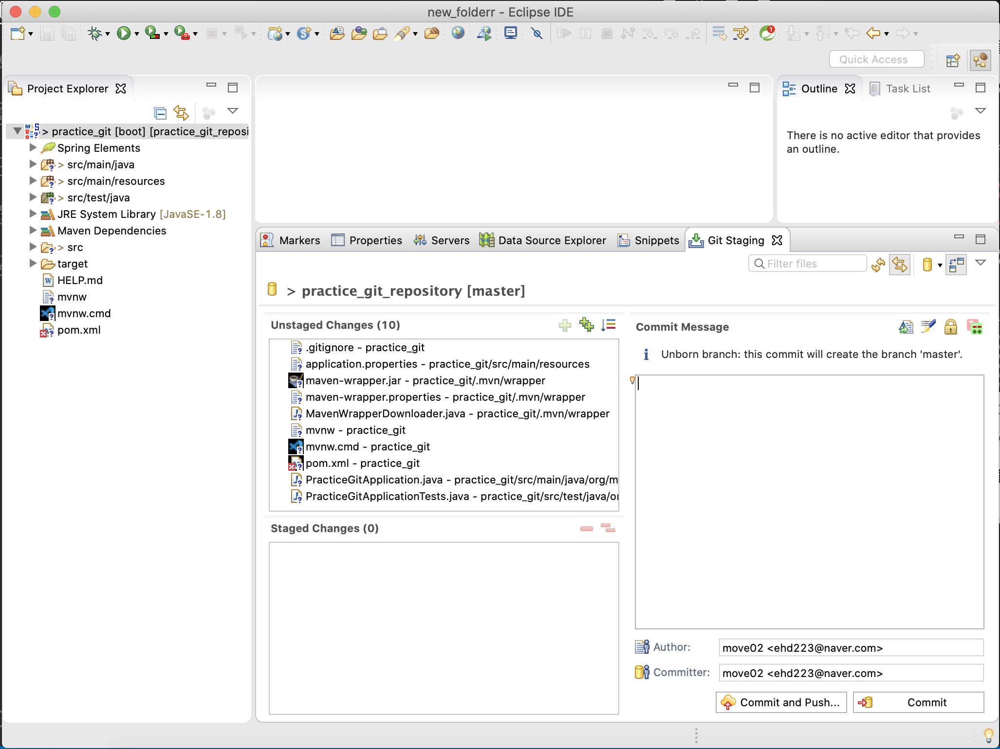

3. **staging된 파일들을 하나의 단위로 묶어서 commit 합니다.**
    1. commit message를 작성하게 됩니다. (변경사항들을 한 눈에 확인할 수 있게 의미있게 정리하여 작성하는 것이 좋습니다.)
    2. commit이 완료되면 local repository에 반영이 됩니다.
    3. commit을 잘못하였다면, 취소하여 staging 단계로 돌리거나 변경사항 자체를 없던 것으로 초기화할 수 있습니다.
    
    `git commit` 명령어를 터미널에서 실행합니다.
    `git commit -m "commit message"`를 하면 commit message 작성과 commit을 동시에 할 수 있습니다.

    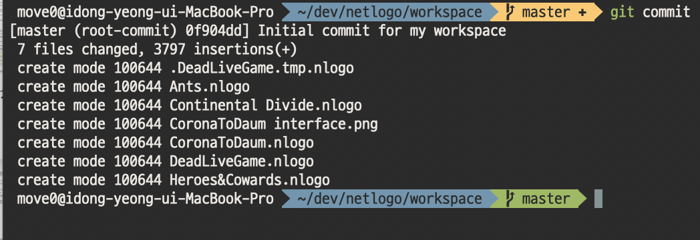
    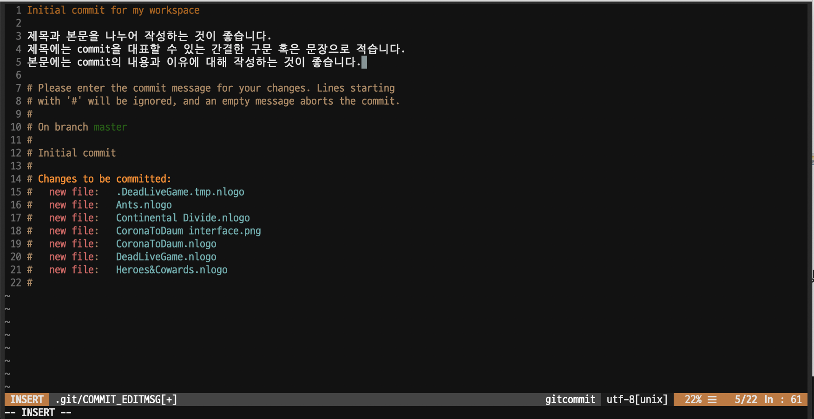

    eclipse에서는 위 2번과 같은 화면에서 staging 및 commit이 가능합니다.
4. **원격 저장소를 만듭니다**
    1. 협업을 위해서는 remote repository를 두는 것이 좋습니다.

    우선 github에서 본인의 원격저장소를 하나 만들어주세요.
    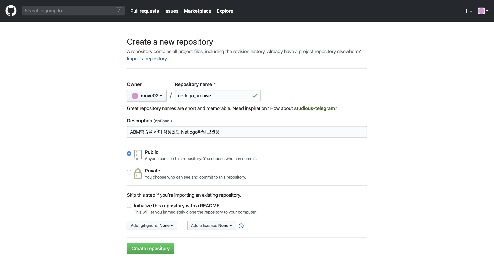
    이후 `git remote add origin [원격저장소url]` 명령어를 통해 내 local repository에 연결할 remote repository의 정보를 입력합니다.
    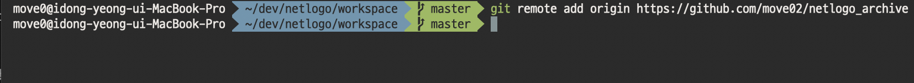
    eclipse에서는 Team > Remote > push를 선택하여 remote 저장소를 추가합니다.
    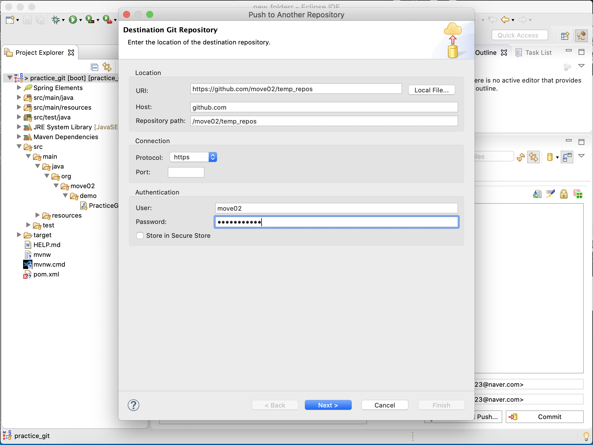

5. **commit을 원격 저장소에 반영합니다.**
    1. 나의 local repository를 올릴 remote repository정보를 추가합니다.
    2. 추가한 remote repository에 현재까지의 commit을 반영(push)합니다.
    3. push된 commit은 되돌리기 어렵습니다.(불가능하지 않으나 같은 branch에서 협업중이라면 상황이 꼬일 수 있습니다.)

    `git push -u origin mastser` 명령어를 입력하여 branch 변경점과 함께 remote repository에 첫 번째 commit을 push 합니다.
    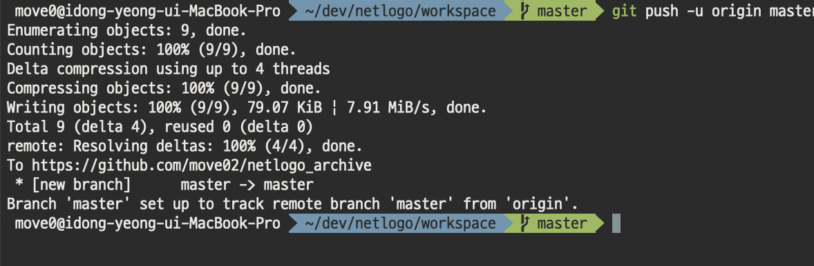

    eclipse 에서는 4번 단계의 그림에서 next를 클릭하시고 아래 사진처럼 push 하시면 됩니다.
    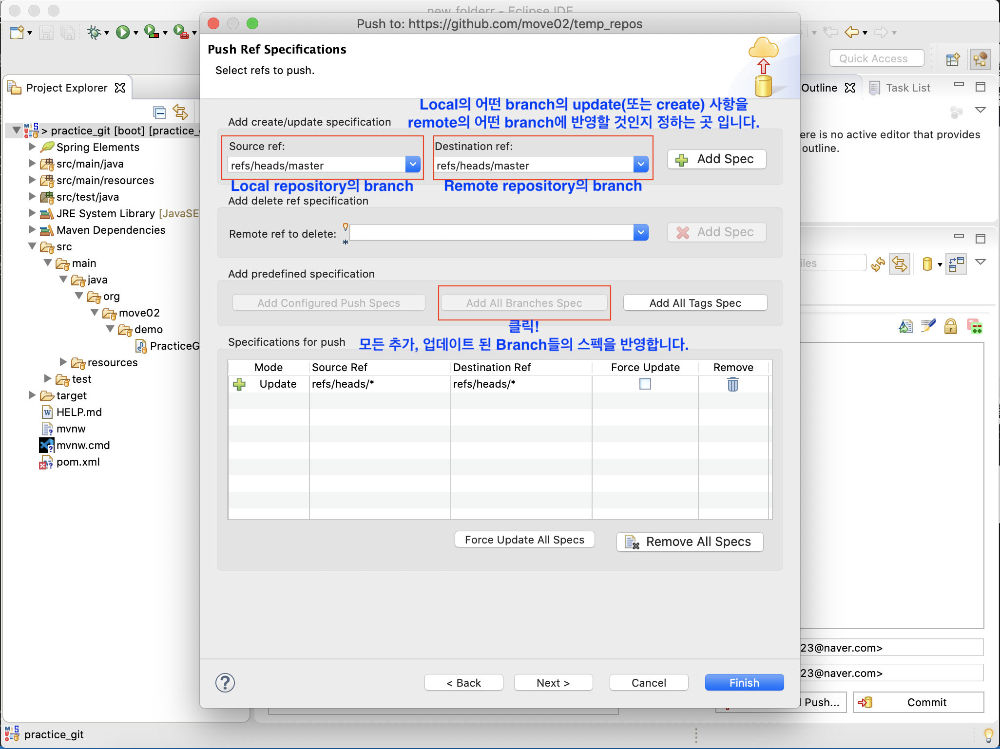
    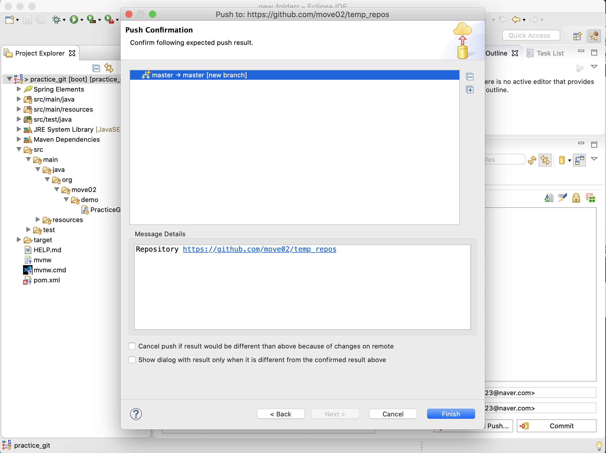

#### Remote의 변경사항을 Local로 받아올 때

간단하게 `git pull`만 입력해도 
