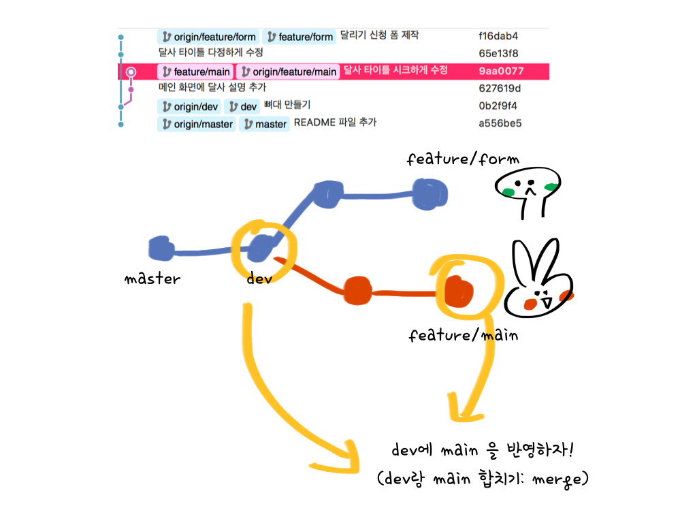
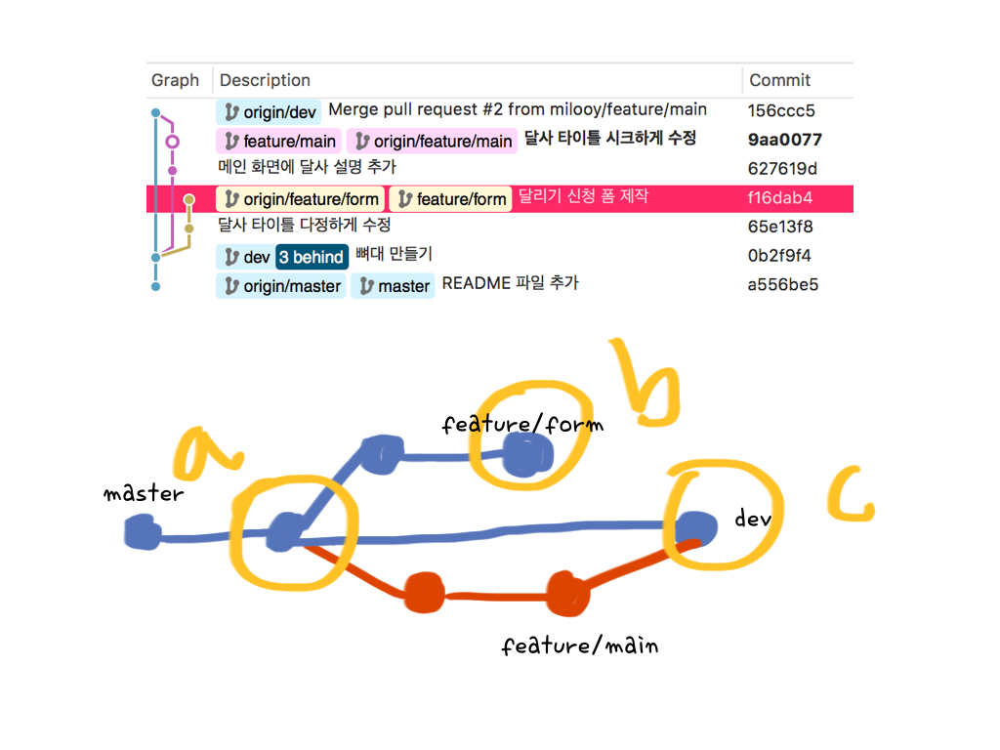

Git 간단 정리2
=====

지난 문서
- [Git 간단정리](./git_간단정리.md)

Git을 처음 사용하는 사람들에게 git이 무엇인지 부터 하나의 저장소를 이용하여 소규모 팀이 협업하는 과정까지 소개와 간단한 실습을 담는 문서입니다.

## Branch
Branch는 git을 다른 것들과 구분짓는 특징이라고들 말합니다. 그러면, Branch가 무엇일까요?

### Branch란 무엇인가?
Git은 SVN과는 다르게 각 commit을 스냅샷의 형태로 저장을 합니다. (SVN은 델타 기반) 이 스냅샷은 일종의 트리구조로 되어있는데 이 트리의 루트는 다시 이전 commit을 가리키는 트리를 이룹니다. 

branch는 이렇게 생긴 commit 사이를 가볍게 이동할 수 있는 **어떤 포인터 같은 것**입니다. 기본적으로 처음 `git init` 명령어를 실행하면 `master` branch를 만들게 되는데, 이후 commit을 할 때마다 `master` branch는 자동으로 가장 마지막 commit을 가리키게 됩니다. (`master`는 특별한 의미가 없는 기본 이름입니다.)

여기까지가 git-scm에 나와있던 branch의 소개입니다.
잘 이해가 안 가지만, commit을 가리키는 **어떤 포인터 같은 것** 이라는 이미지를 갖게 되었습니다. 

branch는 한국어로 **가지** 라는 뜻입니다. branch를 새로 만들고, 그 위에서 개발을 한다는 뜻은 원래의 뿌리에서 새로운 가지를 치고 별도로 개발을 한다는 뜻입니다.

여러 개발자가 개발을 하다보면 각자 다른 기능을 개발하거나 다른 이슈를 해결해야하는 상황이 있습니다. 이때 어느 기점으로 서로 가지를 나누어 개발을 하고 필요할 때만 합치면 서로의 변경점에 영향을 받지 않고 개발을 이어나갈 수 있습니다.

위 그림을 보면, 거북이(초록색)와 토끼(빨간색)가 dev 브랜치에서 뻗어나온 feature/form 과 feature/main 브랜치를 나누어 작업하기로 한 것을 볼 수 있습니다.

어느 한 쪽의 작업이 완료되면 두 번째 그림과 같이 dev 브랜치에 토끼가 작성한 feature/main 브랜치를 합치게 됩니다. 이 때 dev 브랜치에 권한을 가진 사용자에게 feature/main 브랜치를 끼워넣을 수 있는지 요청하는 것을 **Pull Request**라고 합니다. dev 브랜치에서는 이 PR을 확인하여 이상이 없으면 병합(merge)를 할 수 있습니다.

거북이도 마찬가지로 개발이 완료되어 dev 브랜치에 **Pull Request**을 날리고 merge가 완료되면 버전 하나가 완성이 됩니다. 

브랜치는 이런 식으로 기능별 혹은 이슈별로 나누어 독립적인 개발을 하기 위해 이용하는 기능입니다.

## Git workflow
Git을 이용한 협업하는 몇 가지 방법이 있습니다. 

1. Centralized Workflow : 하나의 Branch에 여러 사람이 commit하는 구조. Git의 특장점인 분산 버전 관리의 이점을 사용할 수는 없지만, 최소한의 명령어로 협업을 진행해볼 수 있는 구조입니다. SVN 사용법과 동일합니다.
2. Feature Branch Workflow : 기능별 Branch를 만들어 작업하는 구조입니다. `master` 브랜치는 항상 버그 프리 상태로 유지하며, 병합(merge)시 권한을 가진 사용자가 Pull Request를 적용할 수 있습니다.
3. Gitflow Workflow : Feature branch workflow와 유사하지만 코드 릴리스를 중심으로 좀 더 엄격한 브랜칭 모델을 제시한 구조입니다. 대형 프로젝트에서도 적용할 수 있는 강건한 작업 절차입니다.
4. Forking Workflow : 개개인마다 공식 저장소를 fork하여 서로 다른 원격 저장소를 운영하고, 공식 저장소의 프로젝트 관리자에게 Pull Request를 보내어 작업하는 구조입니다. 오픈소스 프로젝트에서 많이 사용하는 방식입니다.

지난 번 문서에서 git 실습은 단일 branch(master)에서만 진행했었습니다. 

### 참고
- <https://milooy.wordpress.com/2017/06/21/working-together-with-github-tutorial/?fbclid=IwAR2eyRyYXucr7hSfj-ERwAtbmvRXiWVHRDSAeLn7F0K584bL_bHdRdmuKHc>