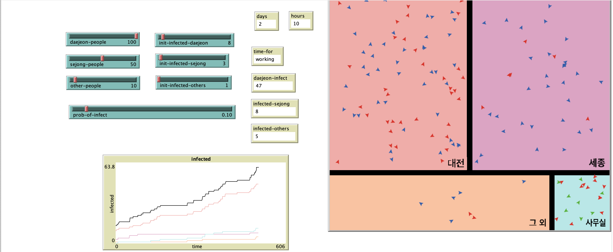
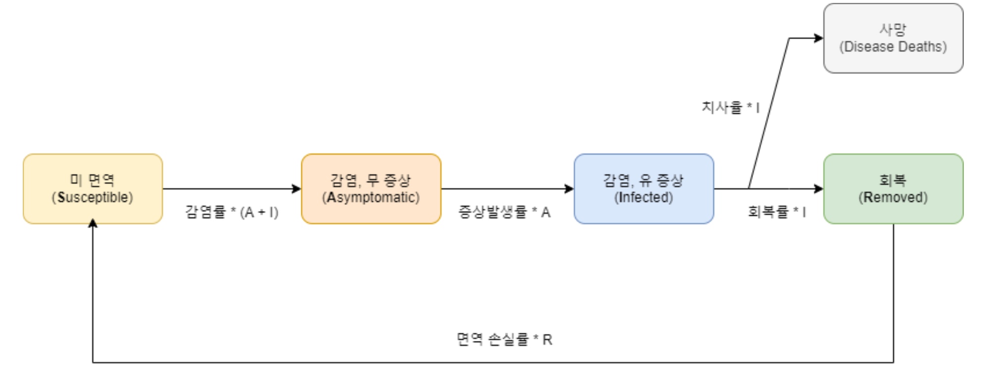

스마트시티 연구소는 코로나 사태를 극복하기 위해 어떤 노력을 하고있을까(작성중)
=====

주제 : 코로나사태 & STEM & 스마트시티

코로나 얘기 -> 해결방법은 무엇일까 -> 찾는 과정 중 STEM 발견 -> STEM 소개 -> 결과물 -> 스마트시티 연구소에서 하는 일 -> 기술로 더 나은 세상을 꿈꾼다.

## 서론
2020년을 힘차게 시작한지 얼마되지 않은 것 같은데, 벌써 4월이네요. 봄은 많은 이들이 기다리는 계절입니다. 추위를 깨고 꽃이 피며 사람들의 마음을 설레이게 만듭니다.
그러나, 코로나 바이러스 때문에 많은 사람들이 화창한 날씨에도 불구하고 밖에 나가지 못하고 있습니다. 백신이 존재하지 않는데다, 잠복기가 존재하기 때문에 누가 보균자인지 판단하기도 어렵습니다.

코로나-19 사태가 장기화 된다면, 어려움을 겪는 사람들이 많아지게 됩니다. 이러한 문제에 맞서기 위해 각 분야에서 많은 전문가 분들이 노력해주고 계시며 저 역시도(다음소프트 스마트시티 연구소도) 이 문제에 대해 고민해보았습니다.

## 본론-1
문제를 해결하기 위해서는 어떤 위험성을 가지고 있는지, 먼저 알아볼 필요가 있습니다. 어떤 전파 양상을 띄는지, 어느 시기에 얼마나 많은 사람들이 감염될 지를 알면 그에 적절한 대응도 가능할 것이라고 생각했습니다. 그러기 위해서는 현재 가지고 있는 정보를 취합해 **시뮬레이션**을 해보는 것이 가장 적절한 방법이라고 생각했습니다.

처음에는 "스마트시티 연구소에 코로나가 도착하기까지" 에 대해 시뮬레이션을 진행해보았습니다. ABM(Agent Based Modeling)이라는 모델링 방법을 사용하여 접근하였고, 미시적 행위자(사람들)의 상호작용으로 거시적 결과(전체 감염자 수, 병의 진행양상)가 어떻게 나타나는지 확인하기 좋은 방법이라고 생각했습니다. (ABM에 관해서는 기회가 되면 글을 또 올려보겠습니다.)

Netlogo라는 툴을 이용하여 시뮬레이션을 작성하였고, 연구소에 출근하는 직원들의 거주지 비율을 따져보면 대전이 가장 많았기에 대전, 세종, 그 외 지역으로 사람들의 속성을 나누었습니다. 저는 감염학의 전문가가 아니기 때문에 단순하게 "감염자 열 명을 만나면 한 번은 걸리겠지." 라고 생각해서 0.1이라는 수치를 감염률로 설정하였습니다.

정말 단순하게 설정하고 시뮬레이션을 돌렸지만, 불과 이틀만에 절반에 가까운 직원이 감염되는 결과를 보였습니다. 물론 이틀만에 절반에 가까운 직원이 감염되지는 않았습니다만, 이 모형을 통해 **감염자 수가 늘어날 수록 전체 감염자 수가 증가하는 속도가 빨라진다**는 것을 알 수 있었습니다.

그러나, 모든 변수를 어림잡아 진행된 시뮬레이션이고 지역간 이동이나 질병이 진행되는 양상, 더 넒은 지역간 교통 등을 표현하기에는 Netlogo라는 학습용 언어로는 한계가 있었습니다.

## 본론-2
조금 더 나은 결과를 얻기 위해 어떻게하면 좋을지 고민해보던 중 연구소장님을 통해 STEM이라는 툴을 알게되었습니다.
STEM은 IBM에서 처음 개발하고 지금은 Eclipse 재단에서 관리되고 있는 오픈소스 프레임워크 입니다. Spatio-Temporal Epidemiological Modeler의 약자로, 그대로 번역하자면 *시공간 역학 모델러* 정도 되는데 무슨 말인지 도무지 감이 오지 않습니다.

> 여기서의 역학(Epidemiology)은 전염병의 원인과 전염 과정에 대해 연구하는 학문을 의미합니다.

이해하기 쉽게 조금 풀어서 써보자면, 전염병의 전염 과정을 시간의 흐름과 공간 모형 위에 모형으로 표현할 수 있는 도구 정도로 말할 수 있겠습니다.

### STEM의 주요 요소
STEM에서 제가 사용했던 요소 중 중요한 것만 몇 가지를 소개하겠습니다.
- Disease Model
    - 전염병의 진행 과정(상태)과 그것들을 이루는 속성을 표현하는 가장 중요한 모델 중 하나입니다.
    - STEM에서는 SIR, SEIR 모델 등 Multi Compartment Model을 기반으로 다양한 확장형 모델을 제공합니다.
- Disease infector, initializer
    - 전염병의 시작을 표현하는 모델입니다. 위치(노드)와 초기 감염자 숫자(혹은 비율) 등을 지정할 수 있습니다
- Transportation Model
    - 인접 지역 간 인구의 이동을 표현하는 모델입니다.
    - 공통 경계를 가진 인접한 두 지역의 인구가 단위시간마다 얼마나 섞이는(이동하는)지를 나타냅니다.
    - 기본 혼합거리와 공통 인접 경계의 길이에 비례합니다.
- Trigger, Predicator, Modifier
    - 특정 시간 혹은 특정 조건을 만족할 때(predicate) 모델의 변수를 수정할 수 있게(modify)합니다.
    - Trigger 안에 Predicator와 Modifier를 넣어 세 개의 요소를 한 쌍의 형태로 묶어 많이 사용합니다.

STEM은 국가의 지도와 지역 별 인구, 항공편 이동 등을 그래프 형식으로 표현해놓은 모델을 제공합니다.
때문에 위에 작성한 요소들만 적절히 이용하면 어렵지 않게 시뮬레이션을 구현할 수 있습니다.

### 코로나-19의 모형
잠깐, 코로나 얘기로 돌아와보겠습니다. 국내에서는 코로나로 인한 사망률이 다른 나라에 비해 많지 않은 편입니다. 높은 수준의 의료체계와 의료계 종사자 분들의 발빠른 대처가 더해진 결과이겠지요. 그럼에도 불구하고, 코로나-19의 무서운 점은 잠복기가 있고 잠복기 중에도 전염성을 갖는다는 것입니다. 그렇다면 이 코로나 바이러스는 어떻게 수학적으로 표현할 수 있을까요?

우선, 잠복기가 존재한다는 점은 감염가능군(Susceptible), 잠복기(Exposed), 감염군(Infected), 회복군(Recovered)로 표현되는 SEIR 모형과 비슷합니다.
그러나 기존의 SEIR 모델은 잠복기인 사람이 감염가능군에 있는 사람을 감염시킬 가능성이 없지만, 코로나는 잠복기인 사람도 전염성을 갖습니다. 또한, 회복이 되었던 사람도 재감염이 된 사례가 있습니다. 이러한 점들에 착안하여 아래와 같이 커스터마이징한 모델을 구현하였습니다.

다른 상태(구획)로 변하는데에 영향을 미치는 주요 변수(parameter)들은 아래와 같습니다.
- 감염률
- 증상발생률
- 회복률
- 치명률
- 면역 손실률

위의 변수들은 우선 임의로 설정하고 다음 단계로 넘어가겠습니다. 4월 7일 날짜를 기준으로 질병관리본부의 통계와 시뮬레이션 결과가 유사하게 되도록 시뮬레이션을 여러 번 진행하면서 조정하였습니다.

### 사회적 거리 두기의 표현

